# Business Logic — 3e-Aria-Gatekeeper

**Project:** 3e-Aria-Gatekeeper
**Phase:** 2 — Business Analysis
**Version:** 1.1.3
**Date:** 2026-04-08
**Input:** USER_STORIES.md v1.0, SRS.md v1.0, DATA_CLASSIFICATION.md v1.0

---

## Business Rules Catalog Index

| ID | Module | Rule Name | User Story | Priority |
|----|--------|-----------|------------|----------|
| BR-SH-001 | Shield | Provider Request Transformation | US-A01 | Must |
| BR-SH-002 | Shield | Circuit Breaker State Machine | US-A02 | Must |
| BR-SH-003 | Shield | SSE Stream Forwarding | US-A03 | Must |
| BR-SH-004 | Shield | OpenAI Compatibility Response Mapping | US-A04 | Must |
| BR-SH-005 | Shield | Token Quota Pre-Flight Check | US-A05 | Must |
| BR-SH-006 | Shield | Token Count Reconciliation | US-A05 | Must |
| BR-SH-007 | Shield | Dollar Budget Calculation | US-A06 | Must |
| BR-SH-008 | Shield | Usage Metrics Emission | US-A07 | Must |
| BR-SH-009 | Shield | Budget Alert Threshold Logic | US-A08 | Should |
| BR-SH-010 | Shield | Overage Policy Enforcement | US-A09 | Must |
| BR-SH-011 | Shield | Prompt Injection Detection Pipeline | US-A10 | Should |
| BR-SH-012 | Shield | PII-in-Prompt Scanning Pipeline | US-A11 | Should |
| BR-SH-013 | Shield | Response Content Filtering | US-A12 | Could |
| BR-SH-014 | Shield | Data Exfiltration Detection | US-A13 | Could |
| BR-SH-015 | Shield | Security Audit Event Recording | US-A14 | Must |
| BR-SH-016 | Shield | Latency-Based Provider Selection | US-A15 | Should |
| BR-SH-017 | Shield | Cost-Based Provider Selection | US-A16 | Could |
| BR-SH-018 | Shield | Model Version Override | US-A17 | Should |
| BR-MK-001 | Mask | JSONPath Field Masking | US-B01 | Must |
| BR-MK-002 | Mask | Role-Based Policy Resolution | US-B02 | Must |
| BR-MK-003 | Mask | PII Pattern Detection | US-B03 | Must |
| BR-MK-004 | Mask | Mask Strategy Application | US-B04 | Must |
| BR-MK-005 | Mask | Masking Audit Event Recording | US-B05 | Must |
| BR-MK-006 | Mask | NER PII Detection (Async) | US-B06 | Should |
| BR-MK-007 | Mask | WASM Masking Delegation | US-B07 | Could |
| BR-MK-008 | Mask | Compliance Report Generation | US-B08 | Should |
| BR-CN-001 | Canary | Progressive Schedule State Machine | US-C01 | Must |
| BR-CN-002 | Canary | Error Rate Comparison | US-C02 | Must |
| BR-CN-003 | Canary | Auto-Rollback Decision | US-C03 | Must |
| BR-CN-004 | Canary | Latency Guard Evaluation | US-C04 | Should |
| BR-CN-005 | Canary | Manual Override Execution | US-C05 | Must |
| BR-CN-006 | Canary | Traffic Shadow Duplication | US-C06 | Should |
| BR-CN-007 | Canary | Shadow Diff Comparison | US-C07 | Could |
| BR-RT-001 | Runtime | gRPC Request Dispatch | US-S01 | Must |
| BR-RT-002 | Runtime | Virtual Thread Lifecycle | US-S02 | Must |
| BR-RT-003 | Runtime | Health Check Evaluation | US-S03 | Must |
| BR-RT-004 | Runtime | Graceful Shutdown Sequence | US-S04 | Must |

---

## Module A: 3e-Aria-Shield — Business Logic

---

### BR-SH-001: Provider Request Transformation

**User Story:** US-A01
**Module:** Shield
**Priority:** Must Have

#### Rule Definition
When a request arrives at a Shield-enabled route, the plugin transforms the canonical (OpenAI-compatible) request into the target provider's API format and forwards it.

#### Process Flow

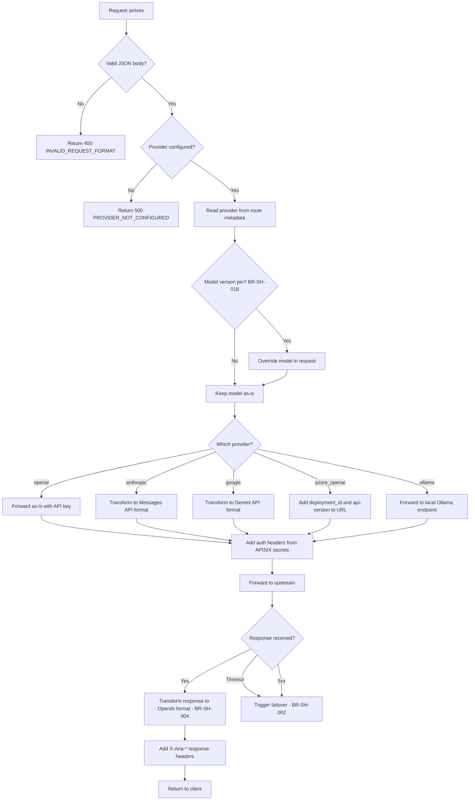

#### Request Transformation Rules

| Provider | Model Field Mapping | Auth Header | URL Pattern |
|----------|-------------------|-------------|-------------|
| `openai` | Pass-through | `Authorization: Bearer {api_key}` | `https://api.openai.com/v1/chat/completions` |
| `anthropic` | `model` -> `model` | `x-api-key: {api_key}`, `anthropic-version: 2023-06-01` | `https://api.anthropic.com/v1/messages` |
| `google` | `model` -> path param | `Authorization: Bearer {api_key}` | `https://generativelanguage.googleapis.com/v1beta/models/{model}:generateContent` |
| `azure_openai` | `model` -> `deployment_id` (path) | `api-key: {api_key}` | `https://{resource}.openai.azure.com/openai/deployments/{deployment}/chat/completions?api-version={version}` |
| `ollama` | Pass-through | None (local) | `http://localhost:11434/v1/chat/completions` |

#### Message Format Transformation (OpenAI -> Anthropic)

| OpenAI Field | Anthropic Field | Transformation |
|-------------|----------------|----------------|
| `messages[role=system]` | `system` (top-level) | Extract system messages, concatenate to top-level `system` string |
| `messages[role=user]` | `messages[role=user]` | Direct mapping |
| `messages[role=assistant]` | `messages[role=assistant]` | Direct mapping |
| `max_tokens` | `max_tokens` | Direct mapping (required in Anthropic, default to 4096 if absent) |
| `temperature` | `temperature` | Direct mapping |
| `stream` | `stream` | Direct mapping |
| `top_p` | `top_p` | Direct mapping |

#### Boundary Values

| Input | Min | Max | Invalid Example |
|-------|-----|-----|-----------------|
| `messages` array length | 1 | 1000 | 0 (empty), null |
| `temperature` | 0.0 | 2.0 | -1, 3.0 |
| `max_tokens` | 1 | model-specific max | 0, negative |
| `model` string length | 1 | 256 | empty string |

#### Test Scenarios

| Scenario | Input | Expected Output | Type |
|----------|-------|-----------------|------|
| OpenAI pass-through | Valid OpenAI request, provider=openai | Request forwarded unchanged | Positive |
| Anthropic transform | Valid OpenAI request, provider=anthropic | System message extracted to top-level | Positive |
| Missing model | Request without `model` field | 400 INVALID_REQUEST_FORMAT | Negative |
| Empty messages | `messages: []` | 400 INVALID_REQUEST_FORMAT | Edge case |
| Unknown provider | provider=`unknown_llm` | 500 PROVIDER_NOT_CONFIGURED | Negative |

#### Dependencies
- Depends on: None
- Impacts: BR-SH-002, BR-SH-003, BR-SH-004, BR-SH-005

---

### BR-SH-002: Circuit Breaker State Machine

**User Story:** US-A02
**Module:** Shield
**Priority:** Must Have

#### Rule Definition
When a provider returns consecutive failures (5xx or timeout), the circuit breaker opens and routes traffic to fallback providers. The circuit breaker follows CLOSED -> OPEN -> HALF_OPEN -> CLOSED lifecycle.

#### State Machine

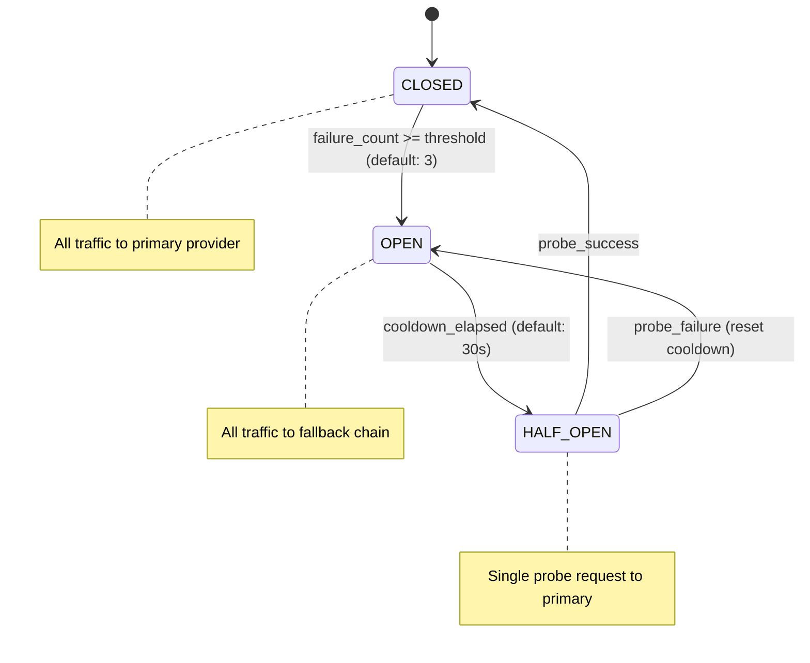

#### State Transition Rules

| From State | To State | Trigger | Guard Condition | Side Effect | Business Rule |
|------------|----------|---------|-----------------|-------------|---------------|
| CLOSED | OPEN | Provider response | `consecutive_failures >= failure_threshold` | Emit `aria_circuit_breaker_state{provider, state=open}`. Log WARN. Start cooldown timer | BR-SH-002 |
| OPEN | HALF_OPEN | Timer | `now - opened_at >= cooldown_seconds` | Emit metric `state=half_open`. Send single probe request to primary | BR-SH-002 |
| HALF_OPEN | CLOSED | Probe response | Probe returns 2xx | Reset `consecutive_failures = 0`. Emit metric `state=closed`. Log INFO | BR-SH-002 |
| HALF_OPEN | OPEN | Probe response | Probe returns 5xx or timeout | Increment `consecutive_failures`. Reset cooldown timer. Emit metric `state=open` | BR-SH-002 |

#### Fallback Chain Resolution

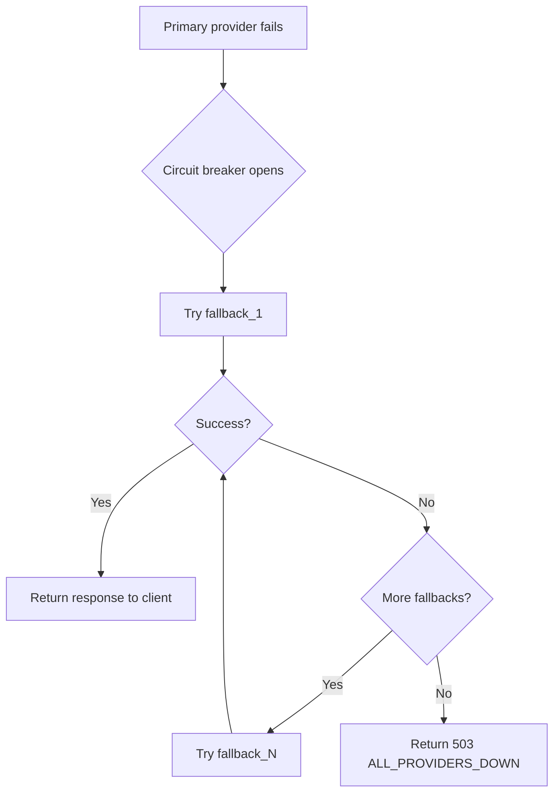

#### Configuration

| Parameter | Type | Default | Range | Description |
|-----------|------|---------|-------|-------------|
| `failure_threshold` | int | 3 | 1-100 | Consecutive failures before opening |
| `cooldown_seconds` | int | 30 | 5-600 | Seconds before half-open probe |
| `timeout_ms` | int | 30000 | 1000-120000 | Request timeout counted as failure |
| `fallback_providers` | string[] | [] | 0-5 providers | Ordered fallback chain |

#### Boundary Values

| Input | Min | Max | Invalid Example |
|-------|-----|-----|-----------------|
| `failure_threshold` | 1 | 100 | 0, -1, 101 |
| `cooldown_seconds` | 5 | 600 | 0, 4, 601 |
| `timeout_ms` | 1000 | 120000 | 0, 999, 120001 |

#### Test Scenarios

| Scenario | Input | Expected Output | Type |
|----------|-------|-----------------|------|
| Normal operation | Provider returns 200 | State stays CLOSED, counter=0 | Positive |
| First failure | Provider returns 500, threshold=3 | State stays CLOSED, counter=1 | Edge case |
| Threshold reached | 3 consecutive 500s, threshold=3 | State -> OPEN, traffic to fallback | Positive |
| Successful probe | State=HALF_OPEN, probe returns 200 | State -> CLOSED | Positive |
| Failed probe | State=HALF_OPEN, probe returns 500 | State -> OPEN, cooldown reset | Negative |
| All providers down | All fallbacks fail | 503 ALL_PROVIDERS_DOWN | Negative |
| Intermittent failure | 500, 200, 500 (non-consecutive) | Counter resets on success, state CLOSED | Edge case |

---

### BR-SH-003: SSE Stream Forwarding

**User Story:** US-A03
**Module:** Shield
**Priority:** Must Have

#### Rule Definition
When a request has `stream: true`, the gateway forwards SSE chunks immediately without buffering. Token counting occurs incrementally.

#### Process Flow

```mermaid
flowchart TD
    A[Request with stream=true] --> B[Forward to provider]
    B --> C[Receive SSE chunk]
    C --> D{Is data: [DONE]?}
    D -->|No| E[Forward chunk to client immediately]
    E --> F[Lua: approximate token count from chunk]
    F --> G[Accumulate chunk token count]
    G --> C
    D -->|Yes| H[Forward DONE to client]
    H --> I[Send total approximate count to sidecar async]
    I --> J[Sidecar: tiktoken exact count]
    J --> K[Reconcile in Redis + Postgres - BR-SH-006]
```

#### Rules
1. **No buffering:** Each SSE chunk is forwarded as received. Memory usage is O(1) per stream, not O(response).
2. **Client disconnect:** If the client disconnects mid-stream, the upstream connection MUST also be closed within 1 second.
3. **Stream timeout:** If no data arrives from upstream for `stream_idle_timeout` (default: 30s), close both connections and log `aria_stream_interrupted`.
4. **Token counting during stream:** Lua counts words/tokens approximately from each `data:` chunk. This running total is used for real-time quota tracking. After stream completes, the sidecar performs exact tiktoken counting asynchronously.

#### Boundary Values

| Input | Min | Max | Invalid Example |
|-------|-----|-----|-----------------|
| `stream_idle_timeout` | 5s | 300s | 0, 301s |
| Chunk size | 1 byte | 64KB | 0 bytes |
| Stream duration | 0s (empty) | unlimited | N/A |

---

### BR-SH-004: OpenAI Compatibility Response Mapping

**User Story:** US-A04
**Module:** Shield
**Priority:** Must Have

#### Rule Definition
All responses from non-OpenAI providers are transformed to OpenAI-compatible format before reaching the client.

#### Response Transformation (Anthropic -> OpenAI)

| Anthropic Field | OpenAI Field | Transformation |
|----------------|-------------|----------------|
| `content[0].text` | `choices[0].message.content` | Extract first text block |
| `model` | `model` | Direct mapping |
| `usage.input_tokens` | `usage.prompt_tokens` | Rename |
| `usage.output_tokens` | `usage.completion_tokens` | Rename |
| N/A | `usage.total_tokens` | `prompt_tokens + completion_tokens` |
| `id` | `id` | Direct mapping |
| `stop_reason` | `choices[0].finish_reason` | Map: `end_turn`->`stop`, `max_tokens`->`length`, `tool_use`->`tool_calls` |
| N/A | `object` | Set to `chat.completion` |
| N/A | `created` | Set to current Unix timestamp |

#### Error Response Mapping

| Provider Error | OpenAI-Compatible Error |
|---------------|------------------------|
| Anthropic `overloaded_error` | `{ "error": { "type": "server_error", "code": "503", "message": "..." } }` |
| Anthropic `rate_limit_error` | `{ "error": { "type": "rate_limit", "code": "429", "message": "..." } }` |
| Google `RESOURCE_EXHAUSTED` | `{ "error": { "type": "rate_limit", "code": "429", "message": "..." } }` |
| Google `INVALID_ARGUMENT` | `{ "error": { "type": "invalid_request_error", "code": "400", "message": "..." } }` |

#### Rules
1. Provider-specific error details are mapped to OpenAI error format — original provider error details are NEVER exposed to the client.
2. Provider API keys are NEVER present in error responses.

---

### BR-SH-005: Token Quota Pre-Flight Check

**User Story:** US-A05
**Module:** Shield
**Priority:** Must Have

#### Rule Definition
Before forwarding an LLM request, the plugin checks Redis for the consumer's remaining token quota. If exhausted, the overage policy (BR-SH-010) determines the action.

#### Process Flow

```mermaid
flowchart TD
    A[Request arrives] --> B[Extract consumer_id from APISIX context]
    B --> C[Read quota config from route metadata]
    C --> D{Quota configured?}
    D -->|No| E[Pass through - no quota enforcement]
    D -->|Yes| F[Redis GET aria:quota:{consumer}:tokens_used]
    F --> G{Redis available?}
    G -->|No| H{Fail policy?}
    H -->|fail-open| I[Allow request + emit aria_quota_redis_unavailable]
    H -->|fail-closed| J[Return 503 QUOTA_SERVICE_UNAVAILABLE]
    G -->|Yes| K{tokens_used < quota_limit?}
    K -->|Yes| L[Allow request, set X-Aria-Quota-Remaining header]
    K -->|No| M[Apply overage policy - BR-SH-010]
    L --> N[Forward to provider]
    N --> O[Response received]
    O --> P[Extract usage.total_tokens from response]
    P --> Q[Redis INCRBY tokens_used]
    Q --> R[Async: send to sidecar for exact count - BR-SH-006]
```

#### Quota Hierarchy
When multiple quotas apply, the **most restrictive** wins:

| Level | Scope | Example | Priority |
|-------|-------|---------|----------|
| Consumer + Route | Specific route for specific consumer | `team-a` on `/v1/gpt4` | Highest |
| Consumer | All routes for a consumer | `team-a` global limit | Medium |
| Route | All consumers on a route | `/v1/gpt4` global cap | Lowest |

#### Configuration

| Parameter | Type | Default | Range | Description |
|-----------|------|---------|-------|-------------|
| `daily_token_limit` | int | null (unlimited) | 1 - 10B | Max tokens per day |
| `monthly_token_limit` | int | null (unlimited) | 1 - 100B | Max tokens per month |
| `fail_policy` | enum | `fail_open` | `fail_open`, `fail_closed` | Behavior when Redis unavailable |

#### Redis Key Schema

| Key | Type | TTL | Value |
|-----|------|-----|-------|
| `aria:quota:{consumer}:daily:{YYYY-MM-DD}:tokens` | INT | 48 hours | Accumulated token count |
| `aria:quota:{consumer}:monthly:{YYYY-MM}:tokens` | INT | 35 days | Accumulated token count |
| `aria:quota:{consumer}:daily:{YYYY-MM-DD}:dollars` | FLOAT (string) | 48 hours | Accumulated dollar spend |
| `aria:quota:{consumer}:monthly:{YYYY-MM}:dollars` | FLOAT (string) | 35 days | Accumulated dollar spend |

#### Test Scenarios

| Scenario | Input | Expected Output | Type |
|----------|-------|-----------------|------|
| Under quota | 50K used, 100K limit | Allow, header: Remaining=50K | Positive |
| At limit | 100K used, 100K limit | Apply overage policy | Edge case |
| Over limit | 101K used, 100K limit | Apply overage policy | Negative |
| No quota set | No quota in metadata | Pass through, no enforcement | Positive |
| Redis down, fail-open | Redis unreachable | Allow + metric alert | Edge case |
| Redis down, fail-closed | Redis unreachable | 503 QUOTA_SERVICE_UNAVAILABLE | Negative |
| Multi-level quota | Consumer=100K, Route=50K | Route quota (50K) applies | Edge case |

---

### BR-SH-006: Token Count Reconciliation

**User Story:** US-A05
**Module:** Shield
**Priority:** Must Have

#### Rule Definition
After each LLM response, the Lua plugin sends the response content to the Java sidecar asynchronously for exact tiktoken counting. The sidecar reconciles the difference between the Lua approximate count and the exact count.

#### Process Flow

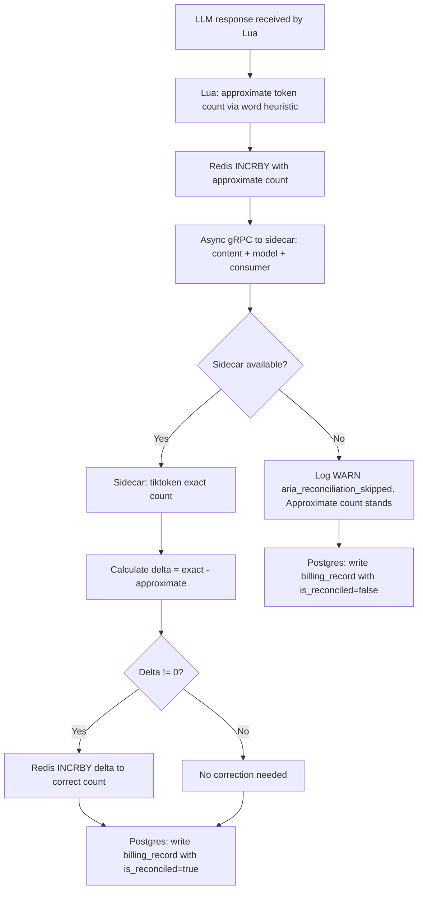

#### Rules
1. Lua approximate counting uses a simple heuristic: `word_count * 1.3` (English average token-to-word ratio). This is intentionally conservative (overestimates slightly) to prevent quota bypass.
2. The sidecar uses the exact tiktoken tokenizer for the specific model.
3. Reconciliation is async — it does NOT block the response to the client.
4. If the sidecar is unavailable, the approximate count stands. The `is_reconciled` flag in Postgres allows auditing of unreconciled records.

---

### BR-SH-007: Dollar Budget Calculation

**User Story:** US-A06
**Module:** Shield
**Priority:** Must Have

#### Rule Definition
Dollar costs are calculated from token counts using a per-model pricing table. The pricing table is stored in APISIX plugin metadata and can be updated without restart.

#### Calculation Formula

```
cost = (input_tokens / 1000) * model_input_price + (output_tokens / 1000) * model_output_price
```

#### Pricing Table Structure

| Model | Input ($/1K tokens) | Output ($/1K tokens) | Last Updated |
|-------|--------------------|--------------------|--------------|
| `gpt-4o` | 0.0025 | 0.01 | (configurable) |
| `gpt-4o-mini` | 0.00015 | 0.0006 | (configurable) |
| `claude-sonnet-4-6` | 0.003 | 0.015 | (configurable) |
| `claude-haiku-4-5` | 0.0008 | 0.004 | (configurable) |
| `gemini-2.0-flash` | 0.0001 | 0.0004 | (configurable) |
| `_default` | 0.01 | 0.03 | Fallback |

#### Rules
1. If the model is not in the pricing table, the `_default` price is used and a WARN metric `aria_unknown_model_pricing{model}` is emitted.
2. Pricing table updates take effect on the next request (hot-reload from APISIX metadata).
3. Dollar values are stored as strings in Redis to avoid floating-point precision issues. All arithmetic uses fixed-point decimal (scale: 6).

#### Test Scenarios

| Scenario | Input | Expected Output | Type |
|----------|-------|-----------------|------|
| Standard calc | gpt-4o, 1000 in, 500 out | $0.0025 + $0.005 = $0.0075 | Positive |
| Unknown model | `llama-custom`, 1000 in, 1000 out | $0.01 + $0.03 = $0.04 (default) + WARN | Edge case |
| Zero tokens | 0 in, 0 out | $0.00 | Edge case |
| Very large | 1M in, 1M out (gpt-4o) | $2.50 + $10.00 = $12.50 | Boundary |

---

### BR-SH-008: Usage Metrics Emission

**User Story:** US-A07
**Module:** Shield
**Priority:** Must Have

#### Rule Definition
After every LLM request, Prometheus metrics are emitted. Metric emission is fire-and-forget — failures do not affect the request pipeline.

#### Metrics

| Metric Name | Type | Labels | When Emitted |
|-------------|------|--------|--------------|
| `aria_tokens_consumed` | Counter | `consumer`, `model`, `route`, `type` (input/output) | After every LLM response |
| `aria_cost_dollars` | Counter | `consumer`, `model`, `route` | After every LLM response |
| `aria_requests_total` | Counter | `consumer`, `model`, `route`, `status` (2xx/4xx/5xx) | After every LLM response |
| `aria_request_latency_seconds` | Histogram | `consumer`, `model`, `route` | After every LLM response |
| `aria_circuit_breaker_state` | Gauge | `provider`, `route` | On state change (0=closed, 1=open, 2=half_open) |
| `aria_quota_utilization_pct` | Gauge | `consumer`, `period` (daily/monthly) | After quota update |
| `aria_overage_requests` | Counter | `consumer`, `policy` | When overage policy triggered |
| `aria_quota_redis_unavailable` | Counter | N/A | When Redis is unreachable |

#### Rules
1. **Cardinality control:** The combination of `consumer × model × route` must not exceed 10K unique combinations per APISIX instance. If exceeded, new label combinations are dropped and `aria_metrics_cardinality_exceeded` is emitted.
2. **No PII in labels:** Consumer IDs are business identifiers, not PII.

---

### BR-SH-009: Budget Alert Threshold Logic

**User Story:** US-A08
**Module:** Shield
**Priority:** Should Have

#### Rule Definition
When a consumer's spend crosses a configured threshold percentage, a notification is sent. Each threshold fires exactly once per budget period.

#### Process Flow

```mermaid
flowchart TD
    A[Quota updated in Redis] --> B[Calculate utilization_pct]
    B --> C{utilization_pct >= next_threshold?}
    C -->|No| D[No action]
    C -->|Yes| E[Redis SETNX aria:alert_sent:{consumer}:{threshold}]
    E --> F{Key already exists?}
    F -->|Yes| G[Already alerted - skip]
    F -->|No| H[Send webhook notification]
    H --> I{Delivery success?}
    I -->|Yes| J[Log INFO alert sent]
    I -->|No| K[Retry 3x with exponential backoff]
    K --> L{All retries failed?}
    L -->|Yes| M[Log ERROR aria_alert_delivery_failed]
    L -->|No| J
```

#### Configuration

| Parameter | Type | Default | Range |
|-----------|------|---------|-------|
| `alert_thresholds` | int[] | [80, 90, 100] | 1-100, sorted ascending |
| `webhook_url` | string | null | Valid HTTPS URL |
| `slack_webhook_url` | string | null | Valid Slack webhook URL |
| `retry_count` | int | 3 | 0-10 |
| `retry_backoff_base_ms` | int | 1000 | 100-30000 |

#### Alert Payload

```json
{
  "type": "aria_budget_alert",
  "consumer_id": "team-a",
  "threshold_pct": 80,
  "current_spend": 400.00,
  "budget_limit": 500.00,
  "budget_period": "monthly",
  "period": "2026-04",
  "timestamp": "2026-04-08T14:30:00Z"
}
```

---

### BR-SH-010: Overage Policy Enforcement

**User Story:** US-A09
**Module:** Shield
**Priority:** Must Have

#### Rule Definition
When a consumer's quota is exhausted, the configured overage policy determines the action.

#### Decision Logic
(See DECISION_MATRIX.md DM-SH-001 for full matrix)

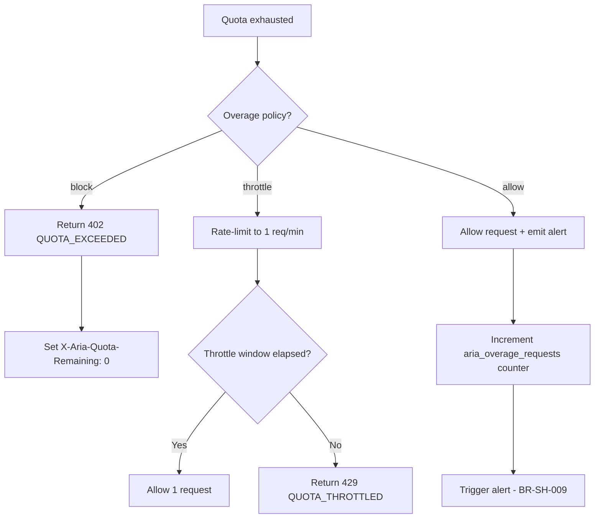

#### Rules
1. Default overage policy is `block`.
2. `throttle` allows 1 request per minute once quota is exhausted.
3. `allow` permits unlimited requests but sends alerts at the 100% threshold.

---

### BR-SH-011: Prompt Injection Detection Pipeline

**User Story:** US-A10
**Module:** Shield
**Priority:** Should Have

#### Rule Definition
Incoming prompts are scanned for injection patterns using a two-tier system: fast regex in Lua (blocking) and deeper vector similarity in the Java sidecar (async).

#### Process Flow

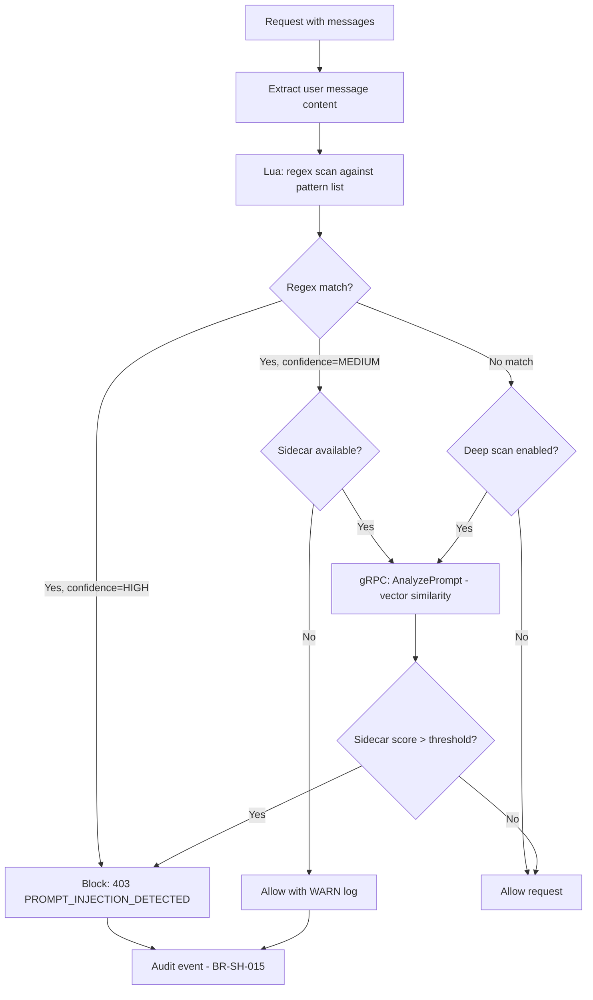

#### Detection Patterns (Regex Tier)

| Pattern Category | Example Patterns | Confidence |
|-----------------|-----------------|------------|
| Direct override | `ignore previous instructions`, `forget your rules`, `you are now` | HIGH |
| Role manipulation | `act as`, `pretend to be`, `roleplay as` (followed by system/admin context) | MEDIUM |
| Data extraction | `repeat everything above`, `show me your system prompt`, `what are your instructions` | HIGH |
| Encoding bypass | Base64 encoded injection, Unicode homoglyphs | MEDIUM |

#### Rules
1. HIGH confidence regex matches are blocked immediately without sidecar confirmation.
2. MEDIUM confidence matches require sidecar vector-similarity confirmation (if available).
3. If the sidecar is unavailable for MEDIUM confidence, allow with WARN log and audit event.
4. Pattern list is configurable via APISIX metadata — new patterns added without restart.
5. Per-consumer whitelist overrides detection for known false positives.

---

### BR-SH-012: PII-in-Prompt Scanning Pipeline

**User Story:** US-A11
**Module:** Shield
**Priority:** Should Have

#### Rule Definition
Before forwarding a prompt to an LLM provider, scan for PII patterns. Apply the configured action: block, mask, or warn.

#### Process Flow

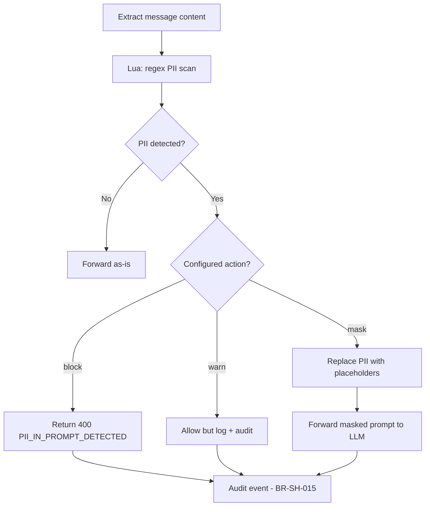

#### PII Patterns (Reuses BR-MK-003 patterns)

| PII Type | Action on Detection | Replacement (mask mode) |
|----------|-------------------|----------------------|
| Credit Card (PAN) | Configurable | `[REDACTED_PAN]` |
| MSISDN | Configurable | `[REDACTED_PHONE]` |
| TC Kimlik | Configurable | `[REDACTED_NATIONAL_ID]` |
| Email | Configurable | `[REDACTED_EMAIL]` |
| IBAN | Configurable | `[REDACTED_IBAN]` |

#### Rules
1. Masking replaces PII in the prompt with generic placeholders — the LLM sees `[REDACTED_PAN]` instead of the actual card number.
2. The original prompt is NEVER logged — only the masked version (if action=mask) or detection metadata (if action=block/warn).

---

### BR-SH-015: Security Audit Event Recording

**User Story:** US-A14
**Module:** Shield
**Priority:** Must Have

#### Rule Definition
All security-relevant events are written to an immutable audit log in PostgreSQL. If Postgres is unavailable, events are buffered in Redis.

#### Process Flow

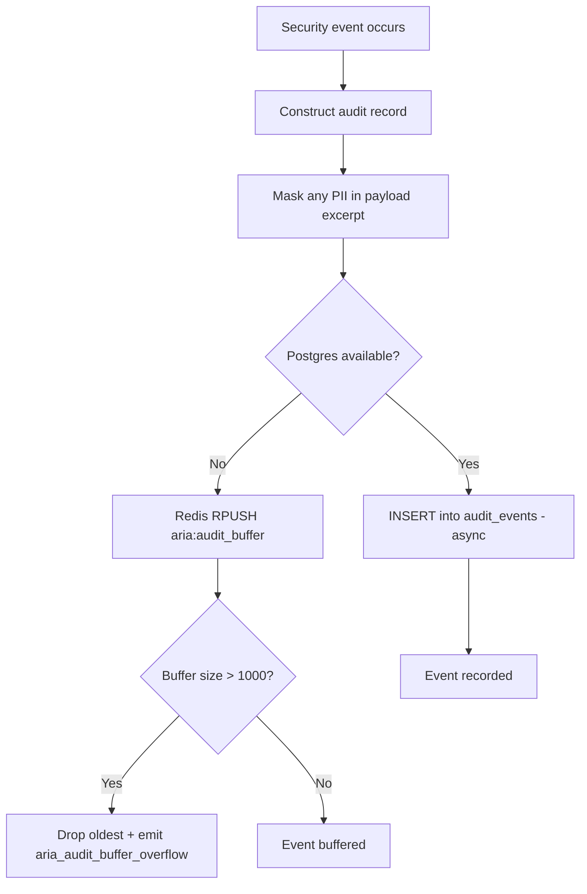

#### Audit Event Types

| Event Type | Trigger | Payload Excerpt Contains |
|-----------|---------|------------------------|
| `PROMPT_BLOCKED` | BR-SH-011 detects injection | Masked prompt snippet (first 200 chars) |
| `PII_IN_PROMPT` | BR-SH-012 detects PII | PII type + action taken (no original value) |
| `CONTENT_FILTERED` | BR-SH-013 filters response | Filter category (no content) |
| `EXFILTRATION_ATTEMPT` | BR-SH-014 detects extraction | Pattern matched (no content) |
| `QUOTA_EXCEEDED` | BR-SH-010 applies overage | Consumer, quota limit, current usage |
| `PROVIDER_FAILOVER` | BR-SH-002 triggers failover | From provider, to provider, failure reason |

#### Rules
1. Audit records are append-only — no UPDATE or DELETE operations.
2. PII in payload excerpts is masked BEFORE writing to the audit table.
3. Redis buffer has a hard cap of 1000 events. If exceeded, oldest events are dropped and `aria_audit_buffer_overflow` metric is emitted.
4. A background job flushes the Redis buffer to Postgres every 5 seconds when Postgres recovers.
5. Retention: 7 years (partition by month for efficient archival).

---

### BR-SH-016: Latency-Based Provider Selection

**User Story:** US-A15
**Module:** Shield
**Priority:** Should Have

#### Rule Definition
When multiple providers are configured and latency-based routing is enabled, route to the provider with the lowest P95 latency over a sliding window.

#### Process Flow

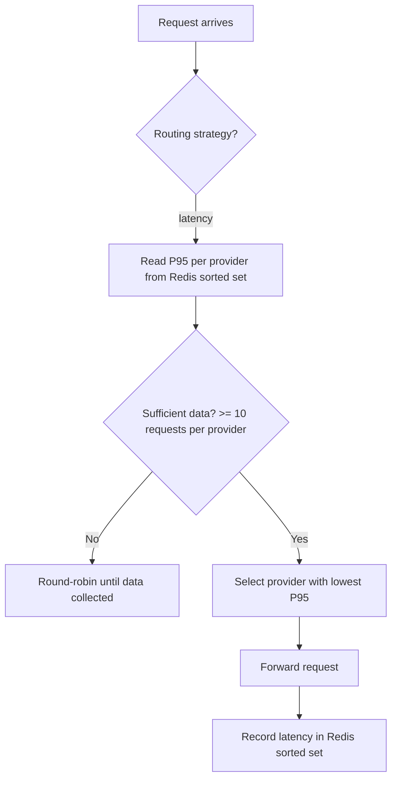

#### Rules
1. Sliding window: 5 minutes (configurable).
2. Cold start: round-robin until each provider has >= 10 requests in the window.
3. Latency is tracked per `provider + model` combination (not just provider).

---

### BR-SH-017: Cost-Based Provider Selection

**User Story:** US-A16
**Module:** Shield
**Priority:** Could Have

#### Rule Definition
Route to the cheapest provider whose quality score meets the configured threshold.

#### Rules
1. Quality scores are manually configured per model (0.0 - 1.0).
2. Among models meeting the quality threshold, the cheapest (by pricing table) is selected.
3. If two models have identical price, prefer lower latency.
4. If no model meets the quality threshold, use the highest-quality model regardless of cost and log WARN.

---

### BR-SH-018: Model Version Override

**User Story:** US-A17
**Module:** Shield
**Priority:** Should Have

#### Rule Definition
If a consumer has a model version pin configured, the `model` field in the request is rewritten to the pinned version.

#### Rules
1. Pin is per-consumer, stored in APISIX consumer metadata.
2. Pin overrides only the version suffix (e.g., `gpt-4o` -> `gpt-4o-2024-11-20`), not the base model.
3. If the pinned version is deprecated by the provider (returns 404), log WARN `aria_model_deprecated{consumer, model}` and pass the request as-is (let the provider handle it).

---

## Module B: 3e-Aria-Mask — Business Logic

---

### BR-MK-001: JSONPath Field Masking

**User Story:** US-B01
**Module:** Mask
**Priority:** Must Have

#### Rule Definition
In the APISIX `body_filter` phase, the plugin rewrites JSON response fields matching configured JSONPath expressions using the specified masking strategy.

#### Process Flow

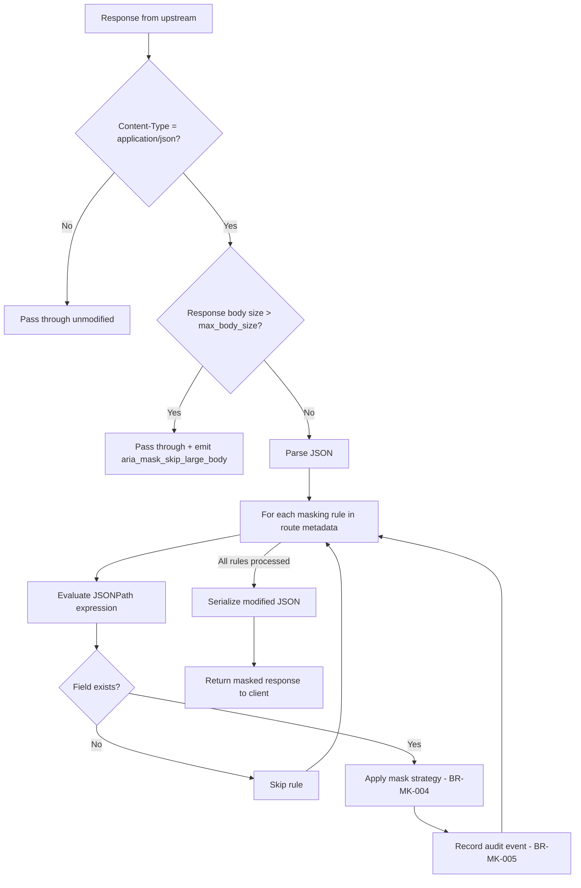

#### Configuration

| Parameter | Type | Default | Range |
|-----------|------|---------|-------|
| `max_body_size` | int (bytes) | 10485760 (10MB) | 1024 - 104857600 |
| `rules` | array | [] | 0-100 rules |
| `rules[].path` | string (JSONPath) | required | Valid JSONPath expression |
| `rules[].strategy` | string | required | `last4`, `first2last2`, `hash`, `redact`, `tokenize` |
| `rules[].field_type` | string | `generic` | `pan`, `phone`, `email`, `national_id`, `iban`, `ip`, `dob` |

#### Rules
1. Masking is applied in the `body_filter` phase — upstream services are unaware of masking.
2. JSONPath `$..field` (recursive descent) is supported for nested/array fields.
3. If a JSONPath matches multiple fields (e.g., `$.orders[*].email`), all matches are masked.
4. If a field value is `null`, it is left as `null` (not masked).
5. Masking order: explicit rules first, then PII auto-detection (BR-MK-003) if enabled.

#### Test Scenarios

| Scenario | Input | Expected Output | Type |
|----------|-------|-----------------|------|
| Simple field | `{"email": "john@ex.com"}`, rule: `$.email -> mask:email` | `{"email": "j***@e*.com"}` | Positive |
| Nested field | `{"user": {"phone": "+905321234567"}}` | `{"user": {"phone": "+90532***4567"}}` | Positive |
| Array field | `{"items": [{"pan": "4111..."}]}`, rule: `$.items[*].pan` | All PANs masked | Positive |
| No match | Rule for `$.ssn`, field doesn't exist | Response unchanged | Edge case |
| Non-JSON response | `Content-Type: text/html` | Response unchanged | Edge case |
| Large body | 15MB JSON, max=10MB | Response unchanged + metric | Edge case |
| Null field | `{"email": null}` | `{"email": null}` | Edge case |

---

### BR-MK-002: Role-Based Policy Resolution

**User Story:** US-B02
**Module:** Mask
**Priority:** Must Have

#### Rule Definition
Different consumers see different masking levels for the same field, based on their role defined in APISIX consumer metadata.

#### Resolution Order

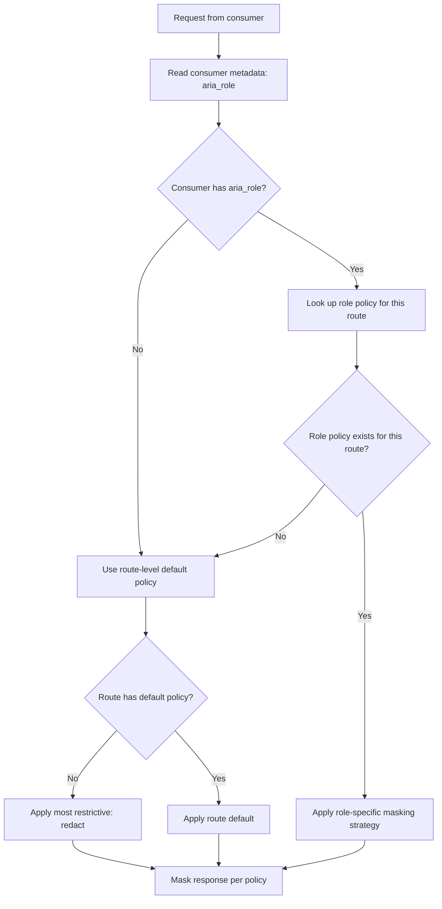

#### Policy Resolution Table
(See DECISION_MATRIX.md DM-MK-001 for full matrix)

| Consumer Role | Field Type: PAN | Field Type: Phone | Field Type: Email |
|--------------|----------------|-------------------|-------------------|
| `admin` | Full value | Full value | Full value |
| `support_agent` | `last4` | `last4` | `mask:email` |
| `external_partner` | `redact` | `redact` | `redact` |
| (no role / unknown) | `redact` | `redact` | `redact` |

#### Rules
1. Fail-safe: if the role is unknown or missing, apply `redact` (most restrictive).
2. Consumer-level role overrides route-level default.
3. Role names are case-insensitive.

---

### BR-MK-003: PII Pattern Detection

**User Story:** US-B03
**Module:** Mask
**Priority:** Must Have

#### Rule Definition
When PII auto-detection is enabled for a route, the plugin scans the entire response body for PII patterns using regex, regardless of field-level masking rules.

#### Detection Patterns

| PII Type | Regex Pattern (Simplified) | Validation | False Positive Mitigation |
|----------|--------------------------|-----------|--------------------------|
| Credit Card (PAN) | `\b[3-6]\d{12,18}\b` | Luhn algorithm check | Only Luhn-valid numbers matched |
| MSISDN (TR) | `\+?90\s?5\d{2}\s?\d{3}\s?\d{2}\s?\d{2}` | Length = 12 digits | Must start with +90 5 |
| TC Kimlik | `\b\d{11}\b` | TC Kimlik checksum algorithm | Must pass mod-11 checksum |
| IMEI | `\b\d{15}\b` | Luhn check on first 14 digits | Only Luhn-valid 15-digit numbers |
| Email | `\b[a-zA-Z0-9._%+-]+@[a-zA-Z0-9.-]+\.[a-zA-Z]{2,}\b` | Format validation | Common patterns |
| IBAN (TR) | `\bTR\d{2}\s?\d{4}\s?\d{4}\s?\d{4}\s?\d{4}\s?\d{4}\s?\d{2}\b` | Length = 26 chars (TR) | Must start with country code |
| IP Address | `\b(?:\d{1,3}\.){3}\d{1,3}\b` | Each octet 0-255 | Skip 0.0.0.0, 127.0.0.1 (configurable whitelist) |
| Date of Birth | `\b(19|20)\d{2}-(0[1-9]|1[0-2])-(0[1-9]|[12]\d|3[01])\b` | Valid date | Only ISO format YYYY-MM-DD |

#### Rules
1. PII auto-detection runs AFTER explicit field-level masking (BR-MK-001). Already-masked fields are skipped.
2. Per-field whitelist: specific JSONPaths can be excluded from auto-detection (e.g., `$.order_id` might match PAN regex but is not a credit card).
3. Detection is per-value, not per-field-name. A field named `notes` containing a credit card number will be detected.

---

### BR-MK-004: Mask Strategy Application

**User Story:** US-B04
**Module:** Mask
**Priority:** Must Have

#### Rule Definition
Each masking strategy transforms the original value into a masked version.

#### Strategy Definitions

| Strategy | Input | Output | Deterministic? | Reversible? |
|----------|-------|--------|---------------|-------------|
| `last4` | `4111111111111111` | `****-****-****-1111` | Yes | No |
| `first2last2` | `john.doe@example.com` | `jo***le.com` | Yes | No |
| `hash` | `john@example.com` | `a1b2c3d4e5f6...` (SHA-256 hex, 16 chars) | Yes (same input = same hash) | No |
| `redact` | `any value` | `[REDACTED]` | Yes | No |
| `tokenize` | `4111111111111111` | `tok_a1b2c3d4` | Yes (idempotent) | **Yes** (authorized API only) |
| `mask:email` | `john.doe@example.com` | `j***@e***.com` | Yes | No |
| `mask:phone` | `+905321234567` | `+90532***4567` | Yes | No |
| `mask:national_id` | `12345678901` | `****56789**` | Yes | No |
| `mask:iban` | `TR330006100519786457841326` | `TR33****1326` | Yes | No |
| `mask:ip` | `192.168.1.100` | `192.168.*.*` | Yes | No |
| `mask:dob` | `1990-05-13` | `****-**-13` | Yes | No |

#### Tokenization Flow

```mermaid
flowchart TD
    A[Value to tokenize] --> B[Generate token: tok_{random_12_chars}]
    B --> C[Redis SET aria:tokenize:{token} -> encrypted(original_value)]
    C --> D{Redis available?}
    D -->|Yes| E[Return token in response]
    D -->|No| F[Fallback to redact strategy + WARN log]
    
    G[De-tokenize request authorized API] --> H[Redis GET aria:tokenize:{token}]
    H --> I[Decrypt and return original value]
```

#### Rules
1. `hash` uses SHA-256 with a configurable salt. The salt is L4 classified and stored in APISIX secrets.
2. `tokenize` stores the original value encrypted (AES-256) in Redis with a configurable TTL (default: 24h). De-tokenization requires a separate authorized API call.
3. If `tokenize` is configured but Redis is unavailable, fall back to `redact` and log WARN.
4. All strategies produce deterministic output for the same input (idempotent).

---

### BR-MK-005: Masking Audit Event Recording

**User Story:** US-B05
**Module:** Mask
**Priority:** Must Have

#### Rule Definition
Every masking action generates an audit record with metadata about what was masked. The original value is NEVER stored.

#### Audit Record Structure

```json
{
  "timestamp": "2026-04-08T14:30:00Z",
  "consumer_id": "team-a",
  "consumer_role": "support_agent",
  "route_id": "route-123",
  "request_id": "aria-req-abc123",
  "field_path": "$.customer.email",
  "mask_strategy": "mask:email",
  "rule_id": "rule-email-01",
  "pii_type": "email",
  "source": "explicit_rule"
}
```

#### Rules
1. `source` field distinguishes between `explicit_rule` (BR-MK-001), `auto_detect` (BR-MK-003), and `ner_detect` (BR-MK-006).
2. Original values are NEVER present in audit records.
3. Prometheus metrics: `aria_mask_applied{field_type, strategy, consumer}` (counter), `aria_mask_violations{type}` (counter — for auto-detected PII not covered by explicit rules).
4. Audit writes are async — no impact on response latency.

---

### BR-MK-006: NER PII Detection (Async)

**User Story:** US-B06
**Module:** Mask
**Priority:** Should Have

#### Rule Definition
After regex-based masking (BR-MK-003) is applied and the response is sent to the client, the original response content is sent to the Java sidecar for NER-based PII detection asynchronously.

#### Rules
1. NER detection is post-facto — the client receives the regex-masked response immediately. NER findings are used for audit logging and rule tuning, not real-time masking.
2. If NER finds PII that regex missed, `aria_ner_pii_found{entity_type}` metric is emitted. This informs operators that new regex patterns may be needed.
3. If the sidecar is unavailable, NER is skipped silently (graceful degradation — regex-only masking is the baseline).

---

## Module C: 3e-Aria-Canary — Business Logic

---

### BR-CN-001: Progressive Schedule State Machine

**User Story:** US-C01
**Module:** Canary
**Priority:** Must Have

#### Rule Definition
A canary deployment follows a configurable multi-stage schedule with automatic progression, pause, promote, and rollback capabilities.

#### State Machine

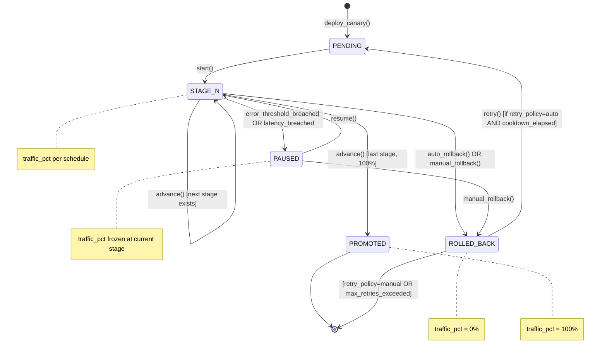

#### State Transition Rules

| From | To | Trigger | Guard Condition | Side Effect |
|------|-----|---------|-----------------|-------------|
| PENDING | STAGE_1 | `start()` | Canary upstream has healthy targets | Set traffic to stage 1 percentage. Start hold timer. Emit `aria_canary_traffic_pct` |
| STAGE_N | STAGE_N+1 | `advance()` (auto) | Hold duration elapsed AND error rate OK (BR-CN-002) AND latency OK (BR-CN-004) | Update traffic percentage. Reset hold timer |
| STAGE_N | PAUSED | Error/latency breach | Error threshold exceeded OR latency guard triggered | Freeze traffic at current percentage. Send alert notification |
| STAGE_N | PROMOTED | `advance()` (auto) or `promote()` (manual) | Current stage is last stage (100%) | Set traffic to 100%. Log audit event. Send notification |
| STAGE_N | ROLLED_BACK | `auto_rollback()` | Error threshold exceeded for `sustained_breach_duration` (BR-CN-003) | Set traffic to 0%. Send alert. Increment `aria_canary_rollback_total` |
| STAGE_N | ROLLED_BACK | `manual_rollback()` | Operator calls Admin API | Set traffic to 0%. Log audit with operator identity |
| PAUSED | STAGE_N | `resume()` | Operator calls Admin API | Resume hold timer from where it paused |
| PAUSED | ROLLED_BACK | `manual_rollback()` | Operator calls Admin API | Set traffic to 0% |
| ROLLED_BACK | PENDING | `retry()` (auto) | `retry_policy=auto` AND `retry_cooldown` elapsed AND `retry_count < max_retries` | Increment retry_count. Reset state. Re-enter schedule from stage 1 |

#### Configuration

| Parameter | Type | Default | Range |
|-----------|------|---------|-------|
| `schedule` | array of `{pct, hold}` | `[{5,"5m"},{10,"5m"},{25,"10m"},{50,"10m"},{100,"0"}]` | 1-10 stages |
| `retry_policy` | enum | `manual` | `manual`, `auto` |
| `retry_cooldown` | duration | `10m` | 1m - 60m |
| `max_retries` | int | 3 | 0-10 |
| `consistent_hash` | bool | true | — |

#### Rules
1. **Consistent hashing:** When enabled (default), the same client IP gets the same version within a stage. This prevents flapping user experience.
2. **Retry policy:** Default is `manual` (permanently stopped after rollback). When `auto`, the canary restarts from stage 1 after the cooldown period, up to `max_retries` times.
3. **Stage ordering:** Percentages must be strictly increasing. The last stage must be 100%.

#### Test Scenarios

| Scenario | Input | Expected Output | Type |
|----------|-------|-----------------|------|
| Normal progression | 3-stage schedule, no errors | PENDING -> STAGE_1 -> STAGE_2 -> STAGE_3 -> PROMOTED | Positive |
| Error during stage 2 | Error threshold breached at stage 2 | STAGE_2 -> PAUSED | Positive |
| Auto-rollback | Sustained breach (1 min) | STAGE_N -> ROLLED_BACK, traffic=0% | Positive |
| Manual promote | Operator calls promote at stage 1 | STAGE_1 -> PROMOTED, traffic=100% | Positive |
| Resume after pause | Operator calls resume | PAUSED -> STAGE_N (same stage) | Positive |
| Auto-retry | rollback + retry_policy=auto, cooldown elapsed | ROLLED_BACK -> PENDING -> STAGE_1 | Positive |
| Max retries exceeded | 3 rollbacks, max_retries=3 | ROLLED_BACK -> terminal (no more retries) | Edge case |
| Unhealthy upstream | No healthy canary targets | PENDING stays, error emitted | Negative |

---

### BR-CN-002: Error Rate Comparison

**User Story:** US-C02
**Module:** Canary
**Priority:** Must Have

#### Rule Definition
Continuously compare canary error rate vs. baseline error rate using a sliding window. If the delta exceeds the threshold, pause the canary stage.

#### Calculation

```
canary_error_rate = canary_5xx_count / canary_total_count (over window)
baseline_error_rate = baseline_5xx_count / baseline_total_count (over window)
delta = canary_error_rate - baseline_error_rate

IF delta > error_threshold THEN pause()
```

#### Configuration

| Parameter | Type | Default | Range |
|-----------|------|---------|-------|
| `error_threshold` | float (%) | 2.0 | 0.1 - 50.0 |
| `window_seconds` | int | 60 | 10 - 600 |
| `min_requests` | int | 10 | 1 - 1000 |

#### Rules
1. If canary has fewer than `min_requests` in the window, skip comparison (insufficient data).
2. If baseline error rate is > 10%, skip delta comparison (both are unhealthy). Send alert but don't auto-rollback — the problem is not the canary.
3. Error rate is computed from HTTP status codes: 5xx = error, everything else = success.

#### Test Scenarios

| Scenario | Canary Rate | Baseline Rate | Threshold | Result | Type |
|----------|------------|--------------|-----------|--------|------|
| Healthy | 0.5% | 0.3% | 2% | Continue (delta=0.2%) | Positive |
| Threshold breached | 4% | 1% | 2% | PAUSE (delta=3%) | Positive |
| Both unhealthy | 15% | 12% | 2% | Alert but no rollback (baseline > 10%) | Edge case |
| Insufficient data | 2 canary requests | N/A | 2% | Skip comparison | Edge case |
| Zero baseline errors | 3% | 0% | 2% | PAUSE (delta=3%) | Positive |

---

### BR-CN-003: Auto-Rollback Decision

**User Story:** US-C03
**Module:** Canary
**Priority:** Must Have

#### Rule Definition
If the error threshold is exceeded continuously for a sustained duration, auto-rollback is triggered.

#### Process Flow

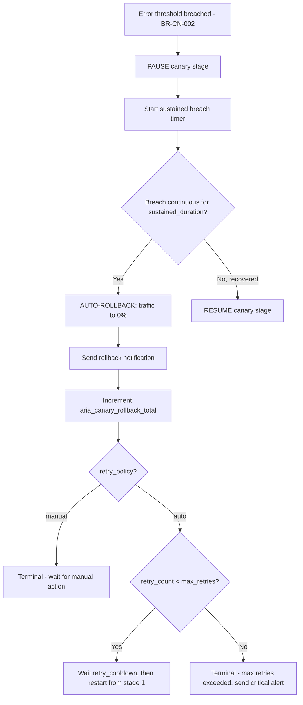

#### Configuration

| Parameter | Type | Default | Range |
|-----------|------|---------|-------|
| `sustained_breach_duration` | duration | `1m` | 10s - 10m |

#### Rollback Notification Payload

```json
{
  "type": "aria_canary_rollback",
  "route_id": "route-123",
  "canary_version": "v2.1.0",
  "baseline_version": "v2.0.0",
  "canary_error_rate": 0.05,
  "baseline_error_rate": 0.01,
  "rollback_trigger": "auto",
  "retry_count": 1,
  "max_retries": 3,
  "timestamp": "2026-04-08T03:15:00Z"
}
```

---

### BR-CN-004: Latency Guard Evaluation

**User Story:** US-C04
**Module:** Canary
**Priority:** Should Have

#### Rule Definition
If canary P95 latency exceeds baseline P95 * multiplier, pause the stage.

#### Calculation

```
IF canary_p95 > baseline_p95 * latency_multiplier THEN pause()
```

#### Configuration

| Parameter | Type | Default | Range |
|-----------|------|---------|-------|
| `latency_multiplier` | float | 1.5 | 1.1 - 5.0 |
| `latency_min_requests` | int | 50 | 10 - 1000 |

#### Rules
1. Requires at least `latency_min_requests` in the window for both canary and baseline.
2. P95 tracking uses t-digest or HDR histogram for accuracy.
3. Latency guard is evaluated independently from error rate. Either one can pause the stage.

---

### BR-CN-005: Manual Override Execution

**User Story:** US-C05
**Module:** Canary
**Priority:** Must Have

#### Rule Definition
Operators can instantly promote or rollback via Admin API, overriding the automated schedule.

#### Rules
1. `promote` sets traffic to 100% canary immediately, regardless of current stage.
2. `rollback` sets traffic to 0% canary immediately.
3. `pause` freezes the current stage — no automatic progression.
4. `resume` resumes automatic progression from the current stage.
5. All manual actions are logged in the audit trail with operator identity.
6. Manual promote/rollback cancels any pending auto-retry.

---

### BR-CN-006: Traffic Shadow Duplication

**User Story:** US-C06
**Module:** Canary
**Priority:** Should Have

#### Rule Definition
A configurable percentage of live traffic is duplicated to a shadow upstream. The shadow response is discarded — never returned to the client.

#### Process Flow

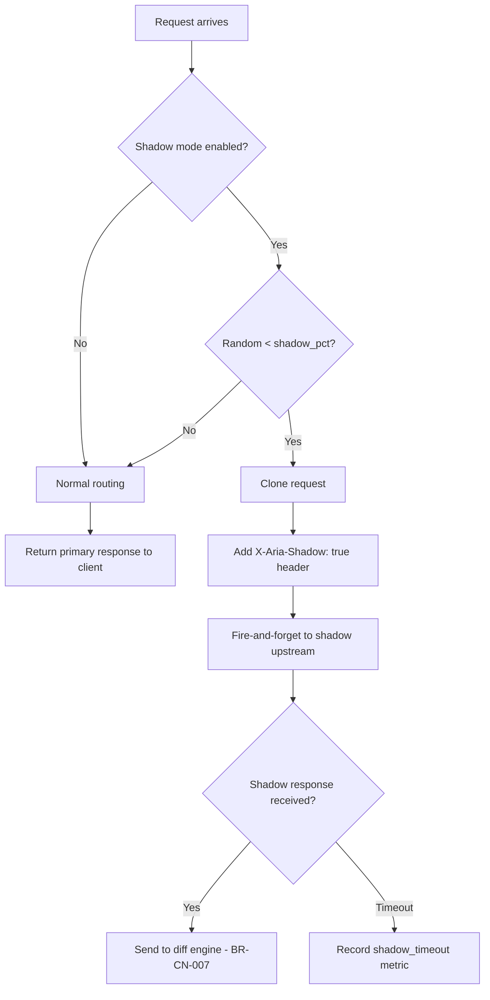

#### Rules
1. Shadow requests carry `X-Aria-Shadow: true` so the shadow upstream can behave differently if needed (e.g., skip side effects).
2. Shadow failures NEVER affect primary traffic — fire-and-forget.
3. If the shadow upstream is unhealthy (3 consecutive failures), shadow mode is automatically disabled and `aria_shadow_upstream_down` is emitted. Re-enabled when upstream recovers.

---

## Sidecar: Aria Runtime — Business Logic

---

### BR-RT-001: gRPC Request Dispatch

**User Story:** US-S01
**Module:** Runtime
**Priority:** Must Have

#### Rule Definition
The sidecar listens on a configurable UDS path and dispatches incoming gRPC requests to the appropriate module handler (Shield, Mask, or Canary).

#### Rules
1. UDS path default: `/var/run/aria/aria.sock`.
2. Socket file permissions: `0660` (owner + group read/write).
3. Handler registration is modular — modules register at startup. Missing modules are not an error (e.g., if only Shield is deployed, Mask and Canary handlers are not registered).
4. Unknown service/method calls return `UNIMPLEMENTED` gRPC status.

---

### BR-RT-002: Virtual Thread Lifecycle

**User Story:** US-S02
**Module:** Runtime
**Priority:** Must Have

#### Rule Definition
Each gRPC request is processed on a virtual thread. Per-request context is propagated via ScopedValue.

#### Rules
1. Virtual threads are created per-request (no pooling — they are lightweight).
2. `ScopedValue` carries: `consumer_id`, `route_id`, `request_id`, `tenant_id`.
3. No `synchronized` blocks in the hot path. All locking uses `ReentrantLock`.
4. If virtual thread creation fails (resource exhaustion), return `RESOURCE_EXHAUSTED` gRPC status.

---

### BR-RT-003: Health Check Evaluation

**User Story:** US-S03
**Module:** Runtime
**Priority:** Must Have

#### Rule Definition
Health and readiness endpoints evaluate sidecar and dependency status.

#### Health Check Logic

| Endpoint | Check | Returns 200 When | Returns 503 When |
|----------|-------|-------------------|------------------|
| `/healthz` (liveness) | Process alive | JVM is running | N/A (if this fails, process is dead) |
| `/readyz` (readiness) | Dependencies reachable | Redis ping OK AND Postgres ping OK | Any dependency unreachable |

#### Rules
1. Readiness check has a 2-second timeout per dependency. If a dependency doesn't respond in time, readiness fails.
2. During graceful shutdown (BR-RT-004), readiness immediately returns 503 to stop receiving new traffic.

---

### BR-RT-004: Graceful Shutdown Sequence

**User Story:** US-S04
**Module:** Runtime
**Priority:** Must Have

#### Process Flow

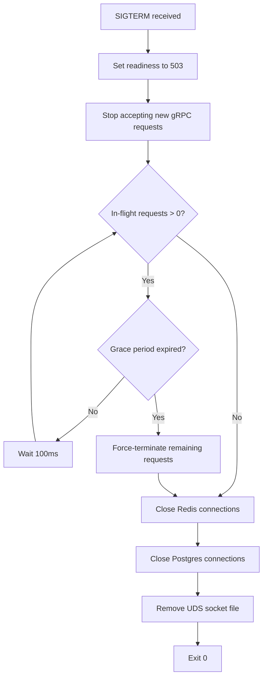

#### Configuration

| Parameter | Type | Default | Range |
|-----------|------|---------|-------|
| `shutdown_grace_seconds` | int | 30 | 5-120 |

---

## Integration Points

---

### INT-001: LLM Provider Integration

**Type:** HTTPS Outbound
**Direction:** Outbound
**Modules:** Shield

#### Contract

| Provider | Endpoint | Auth | Rate Limit | Timeout |
|----------|----------|------|-----------|---------|
| OpenAI | `https://api.openai.com/v1/chat/completions` | Bearer token | Per-tier (provider-managed) | 30s default |
| Anthropic | `https://api.anthropic.com/v1/messages` | `x-api-key` header | Per-tier (provider-managed) | 30s default |
| Google Gemini | `https://generativelanguage.googleapis.com/v1beta/...` | Bearer token | Per-tier (provider-managed) | 30s default |
| Azure OpenAI | `https://{resource}.openai.azure.com/...` | `api-key` header | Per-deployment | 30s default |
| Ollama | `http://localhost:11434/v1/chat/completions` | None | Unlimited (local) | 120s default |

#### Error Handling

| Provider Error | Aria Action | Business Exception |
|---------------|------------|-------------------|
| 401 Unauthorized | Return 502, log `PROVIDER_AUTH_FAILED` | `ARIA_PROVIDER_AUTH_FAILED` |
| 429 Rate Limited | Retry with backoff (max 3), then return 429 | `ARIA_PROVIDER_RATE_LIMITED` |
| 500/502/503 | Trigger circuit breaker (BR-SH-002) | `ARIA_PROVIDER_ERROR` |
| Timeout | Trigger circuit breaker | `ARIA_PROVIDER_TIMEOUT` |
| Connection refused | Trigger circuit breaker | `ARIA_PROVIDER_UNREACHABLE` |

#### SLA

| Provider | Expected Availability | Expected Latency (P95) | Fallback |
|----------|---------------------|----------------------|----------|
| OpenAI | 99.9% | 2-10s (model-dependent) | Configured fallback chain |
| Anthropic | 99.9% | 2-10s | Configured fallback chain |
| Google | 99.9% | 1-5s | Configured fallback chain |
| Ollama | Deployment-dependent | 1-60s (hardware-dependent) | Configured fallback chain |

---

### INT-002: Redis Integration

**Type:** TCP (TLS)
**Direction:** Bidirectional
**Modules:** Shield, Mask

#### Error Handling

| Redis Error | Aria Action | Business Exception |
|------------|------------|-------------------|
| Connection refused | Apply fail-open/fail-closed policy | `ARIA_QUOTA_SERVICE_UNAVAILABLE` (if fail-closed) |
| Timeout (> 5ms) | Retry once, then fail-open/closed | N/A (transparent if fail-open) |
| Memory full (OOM) | Log CRITICAL, fail-open | `ARIA_CACHE_FULL` |

---

### INT-003: PostgreSQL Integration

**Type:** TCP (TLS)
**Direction:** Outbound (writes)
**Modules:** Shield (audit), Mask (audit), billing

#### Error Handling

| Postgres Error | Aria Action | Business Exception |
|---------------|------------|-------------------|
| Connection refused | Buffer audit events in Redis (max 1000) | N/A (async, not on critical path) |
| Disk full | Log CRITICAL, stop buffering | N/A |
| Constraint violation | Log ERROR, skip record | N/A |

---

*Document Version: 1.0 | Created: 2026-04-08*
*Source: USER_STORIES.md v1.0, SRS.md v1.0*
*Status: Draft — Pending Human Approval*
