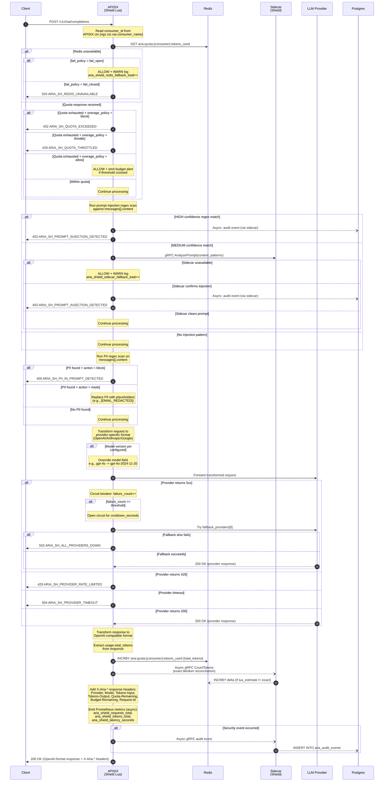
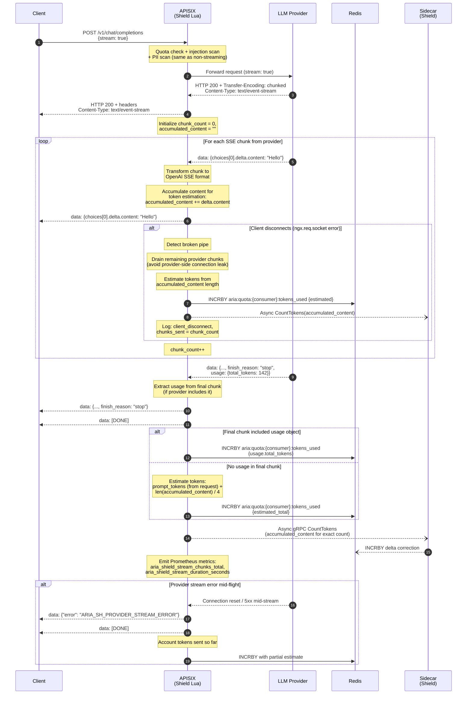
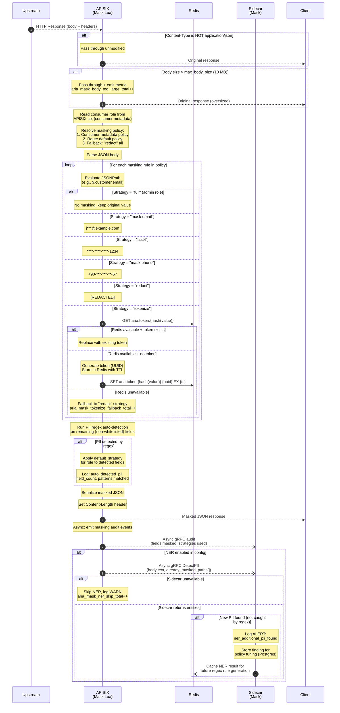
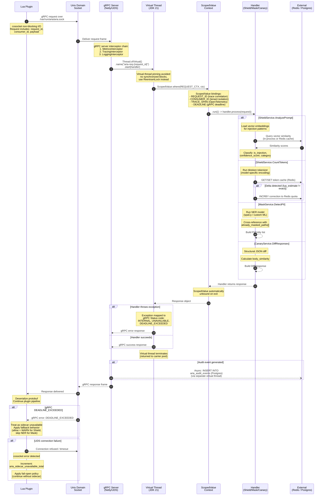
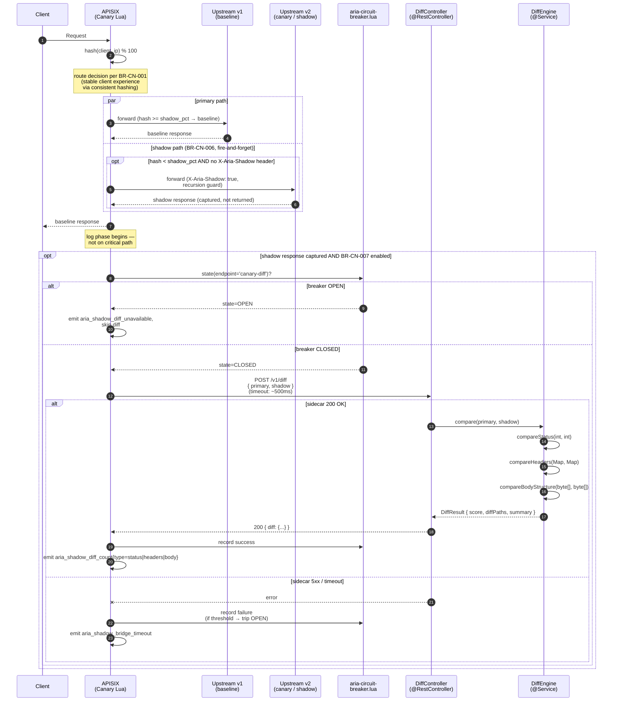

# Sequence Diagrams — 3e-Aria-Gatekeeper

**Project:** 3e-Aria-Gatekeeper
**Phase:** 4 — Design
**Version:** 1.1.3
**Date:** 2026-04-25 (v1.1.3 spec-coherence sweep); 2026-04-08 (v1.0 baseline)
**Author:** AI Architect + Human Oversight
**Input:** HLD.md v1.1.1, API_CONTRACTS.md v1.1, INTEGRATION_MAP.md v1.1.3, ADR-008, ADR-009
**v1.1.3 Driver:** v1.0 was missing every sidecar interaction shipped after 2026-04-08. Adds §6 NER bridge (BR-MK-006), §7 Canary shadow diff (BR-CN-007), §8 Audit pipeline LPOP drain (ADR-009). Updates Cross-Cutting Concerns (transport row "Sidecar (UDS)" → "Sidecar HTTP loopback" per ADR-008; Postgres failure mode for audit reflects AuditFlusher behaviour). §5 retains its title for historical continuity but adds an HTTP-bridge precedence note.

---

## Table of Contents

1. [Shield: LLM Request (Full Flow)](#1-shield-llm-request-full-flow)
2. [Shield: SSE Streaming Flow](#2-shield-sse-streaming-flow)
3. [Mask: Response Masking Flow](#3-mask-response-masking-flow)
4. [Canary: Progressive Deployment Lifecycle](#4-canary-progressive-deployment-lifecycle)
5. [Sidecar: gRPC Request Lifecycle](#5-sidecar-grpc-request-lifecycle) — **forward-compat only in v0.1**; HTTP bridge is the canonical Lua transport (ADR-008). New Lua-callable sequences land in §6+.
6. [Mask NER Bridge (HTTP, BR-MK-006)](#6-mask-ner-bridge-http-br-mk-006)
7. [Canary Shadow Diff (HTTP, BR-CN-007)](#7-canary-shadow-diff-http-br-cn-007)
8. [Audit Pipeline LPOP Drain (ADR-009)](#8-audit-pipeline-lpop-drain-adr-009)

---

## 1. Shield: LLM Request (Full Flow)

**Covers:** Complete request lifecycle from client through Shield plugin to LLM provider and back, including quota enforcement, prompt injection detection, PII scanning, provider failover, token accounting, and audit trail.



**Key Design Decisions:**

- **Fail-open vs. fail-closed** is configurable per consumer via `quota.fail_policy`. Fail-open is the default to avoid blocking production traffic when Redis is temporarily unavailable; the warn log and metric allow operators to detect and remediate.
- **Two-tier injection detection:** Regex runs in Lua (fast, no network hop). Only MEDIUM-confidence matches go to the sidecar for vector similarity analysis, keeping p99 latency low for clean requests.
- **Approximate-then-reconcile token counting:** Lua uses the provider-reported `usage.total_tokens` for immediate quota update. The sidecar runs exact tiktoken counting asynchronously and corrects any delta, ensuring eventual accuracy without blocking the response path.
- **Circuit breaker state** is kept in Lua shared dict (per-worker) rather than Redis to avoid adding another Redis round-trip in the critical path. Providers are tried in order from `fallback_providers[]`.

---

## 2. Shield: SSE Streaming Flow

**Covers:** Server-Sent Events (SSE) streaming for `stream: true` requests, including chunk-by-chunk forwarding, incremental token counting, client disconnect handling, and final usage reconciliation.



**Key Design Decisions:**

- **Chunk-by-chunk forwarding:** Each SSE chunk is forwarded to the client as it arrives from the provider. Shield does not buffer the entire response -- this preserves streaming latency (time-to-first-token).
- **Content accumulation:** Shield accumulates `delta.content` from all chunks in memory for two purposes: (1) post-stream token estimation, and (2) passing the full content to the sidecar for exact token counting.
- **Client disconnect handling:** When the client disconnects mid-stream, Shield continues to drain remaining chunks from the provider to avoid orphaned upstream connections, then performs best-effort token accounting.
- **Token estimation fallback:** Not all providers include `usage` in the final SSE chunk. When absent, Shield uses the heuristic `len(content) / 4` for approximate token count, corrected later by the sidecar's exact tiktoken calculation.

---

## 3. Mask: Response Masking Flow

**Covers:** Response body masking on the return path, including content-type gating, role-based policy resolution, JSONPath masking, PII auto-detection, tokenization with Redis, and optional NER via sidecar.



**Key Design Decisions:**

- **Content-Type and body-size gates** run first to avoid unnecessary JSON parsing. Oversized bodies are passed through with a metric emitted so operators can tune `max_body_size` or investigate.
- **Three-level policy resolution** (consumer > route > fallback "redact") ensures that no response leaks unmasked PII even when configuration is incomplete -- the strictest strategy is the default.
- **Tokenization fallback:** When Redis is unavailable and the strategy is `tokenize`, the plugin falls back to `redact` rather than failing the request. This maintains availability at the cost of losing the reversible token mapping.
- **NER is asynchronous and optional:** The sidecar-based NER scan runs after the response has already been sent to the client (post-body_filter). Its purpose is to detect PII that regex missed, feeding back into policy tuning rather than blocking the response path.

---

## 4. Canary: Progressive Deployment Lifecycle

**Covers:** End-to-end canary deployment lifecycle from operator configuration through progressive traffic shifting, health monitoring, auto-rollback, manual overrides, and retry policies.

```mermaid
sequenceDiagram
    autonumber
    participant OP as Operator
    participant ADM as APISIX<br/>Admin API
    participant CN as APISIX<br/>(Canary Lua)
    participant R as Redis
    participant SC as Sidecar
    participant WH as Webhook

    %% --- Configuration ---
    OP->>ADM: PUT /apisix/routes/{id}<br/>plugins.aria-canary = {schedule, thresholds}
    ADM-->>OP: 200 OK

    Note over CN: Load schedule:<br/>[5%, 10%, 25%, 50%, 100%]<br/>State = STAGE_1 (5%)

    CN->>R: SET aria:canary:{route}:state STAGE_1
    CN->>R: SET aria:canary:{route}:pct 5

    %% --- Request Routing ---
    loop For each incoming request
        Note over CN: hash = crc32(client_ip) mod 100

        alt hash < traffic_pct (canary)
            CN->>CN: Route to canary_upstream
            Note over CN: Record: status, latency<br/>in sliding window (shared dict)
        else hash >= traffic_pct (baseline)
            CN->>CN: Route to baseline_upstream
            Note over CN: Record: status, latency<br/>in sliding window (shared dict)
        end

        Note over CN: Increment request counters<br/>in Redis (per-stage)
    end

    %% --- Health Check (timer-based) ---
    Note over CN: Timer fires after<br/>hold_duration expires

    CN->>R: GET canary + baseline<br/>error rates and latency

    alt Error delta > threshold_pct (2%)
        CN->>R: SET state = PAUSED
        CN--)WH: POST canary_health_breach<br/>{route, error_rates, stage}

        Note over CN: Start sustained breach timer<br/>(sustained_breach_seconds = 60)

        alt Breach sustained > 60s
            CN->>R: SET state = ROLLED_BACK
            CN->>R: SET pct = 0
            CN--)WH: POST aria_canary_rollback<br/>{trigger: "auto", retry_count}

            alt retry_policy = manual
                Note over CN: Terminal state.<br/>Operator must intervene.
            else retry_policy = auto
                Note over CN: Wait retry_cooldown (10m)
                alt retry_count < max_retries
                    CN->>R: INCR retry_count
                    CN->>R: SET state = STAGE_1, pct = 5
                    Note over CN: Restart from stage 1
                else retry_count >= max_retries
                    CN->>R: SET state = ROLLED_BACK_FINAL
                    CN--)WH: POST canary_max_retries_exhausted
                    Note over CN: Terminal state
                end
            end
        else Breach recovers within 60s
            CN->>R: SET state = RESUMED (current stage)
            CN--)WH: POST canary_resumed<br/>{route, stage}
            Note over CN: Reset hold timer,<br/>continue at current stage
        end

    else Latency p95 > baseline * multiplier (1.5x)
        CN->>R: SET state = PAUSED
        CN--)WH: POST canary_latency_breach<br/>{canary_p95, baseline_p95}
        Note over CN: Same sustained breach flow<br/>as error delta above

    else Both healthy + hold_duration elapsed
        alt Current stage is final (100%)
            CN->>R: SET state = PROMOTED, pct = 100
            CN--)WH: POST aria_canary_promoted<br/>{route, total_duration}
            Note over CN: Canary is now<br/>the production upstream
        else Not final stage
            Note over CN: ADVANCE to next stage
            CN->>R: SET state = STAGE_{n+1}<br/>pct = schedule[n+1].pct
            CN--)WH: POST canary_stage_advanced<br/>{from_stage, to_stage, pct}
            Note over CN: Reset hold timer for<br/>new stage duration
        end
    end

    %% --- Manual Overrides ---
    rect rgb(240, 240, 255)
        Note over OP,WH: Manual Override Paths

        OP->>ADM: POST /aria/canary/{route}/promote
        ADM->>CN: Update route config
        CN->>R: SET state = PROMOTED, pct = 100
        CN--)WH: POST canary_promoted<br/>{promoted_by: operator}

        OP->>ADM: POST /aria/canary/{route}/rollback
        ADM->>CN: Update route config
        CN->>R: SET state = ROLLED_BACK, pct = 0
        CN--)WH: POST canary_rollback<br/>{rolled_back_by: operator}

        OP->>ADM: POST /aria/canary/{route}/pause
        ADM->>CN: Update route config
        CN->>R: SET state = PAUSED
        Note over CN: Traffic holds at<br/>current percentage

        OP->>ADM: POST /aria/canary/{route}/resume
        ADM->>CN: Update route config
        CN->>R: SET state = current stage
        Note over CN: Resume hold timer<br/>from where paused
    end
```



**Key Design Decisions:**

- **Consistent hashing:** `crc32(client_ip) mod 100` ensures the same client consistently hits the same upstream during a canary, avoiding session-level inconsistencies. The `consistent_hash` config flag controls this behavior.
- **Sustained breach timer:** A single error spike does not trigger rollback. The error rate must remain above the threshold for `sustained_breach_seconds` (default 60s) to avoid rollback on transient blips.
- **Two-phase rollback:** PAUSE comes first, giving the system time to recover. Only if the breach is sustained does the canary proceed to ROLLED_BACK. This prevents unnecessary rollbacks during brief transient errors.
- **Retry policy:** When `retry_policy = auto`, the system waits `retry_cooldown` then restarts from stage 1, up to `max_retries` times. When `retry_policy = manual`, rollback is terminal and requires operator intervention. This prevents infinite retry loops while allowing automated recovery for transient deployment issues.
- **Metrics are kept in Lua shared dict** (per APISIX worker, aggregated on read) for the sliding window, with periodic flush to Redis for cross-worker and cross-restart consistency.

---

## 5. Sidecar: gRPC Request Lifecycle

**Covers:** Internal lifecycle of a gRPC request from Lua plugin through the Java 21 sidecar, including Unix Domain Socket transport, virtual thread creation, ScopedValue propagation, handler dispatch, and async response flow.



**Key Design Decisions:**

- **Unix Domain Socket (UDS):** Communication between Lua plugins and the Java sidecar uses `/var/run/aria/aria.sock` instead of TCP. UDS eliminates TCP overhead (no three-way handshake, no Nagle, no port exhaustion) and provides kernel-level access control via file permissions.
- **Virtual threads (JDK 21):** Each gRPC request is handled on a virtual thread rather than a platform thread. This allows the sidecar to handle thousands of concurrent requests without thread pool sizing concerns. The `synchronized` keyword is avoided in handler code to prevent virtual thread pinning.
- **ScopedValue over ThreadLocal:** `ScopedValue` (JDK 21) is used instead of `ThreadLocal` for request context propagation. ScopedValues are immutable within their scope, automatically cleaned up, and compatible with virtual threads without the memory leak risks of ThreadLocal.
- **Fail-open from Lua side:** When the sidecar is unreachable (UDS connection failure or gRPC deadline exceeded), the Lua plugin always continues with degraded functionality rather than blocking the request. The sidecar provides enhanced analysis but is never in the critical path for request completion.
- **gRPC interceptor chain** handles cross-cutting concerns (metrics, tracing, logging) before handler dispatch, keeping handler code focused on business logic.

---

## 6. Mask NER Bridge (HTTP, BR-MK-006)

**Covers:** Lua Mask plugin delegates named-entity detection to the sidecar over the HTTP bridge (`POST /v1/mask/detect`) per ADR-008, with two-layer circuit breaker (Lua outer via `aria-circuit-breaker.lua` `ngx.shared.dict` state + Java inner via Resilience4j) and fail-open/fail-closed policy. Shipped 2026-04-24.

```mermaid
sequenceDiagram
    autonumber
    participant U as Upstream
    participant MK as APISIX<br/>(Mask Lua)
    participant CB as aria-circuit-<br/>breaker.lua<br/>(ngx.shared.dict)
    participant MC as MaskController<br/>(@RestController)
    participant NDS as NerDetectionService<br/>(@Service + Resilience4j)
    participant CNE as CompositeNerEngine
    participant ONE as OpenNlpNer<br/>Engine (English)
    participant DJL as DjlHuggingFace<br/>NerEngine (Turkish)

    U->>MK: JSON response (body_filter)
    MK->>MK: regex PII scan first<br/>(don't send pre-classified fields to ML)
    MK->>MK: collect candidate fields<br/>(ner.sidecar.entity_strategy)

    MK->>CB: state(endpoint='mask-ner')?
    alt breaker OPEN
        CB-->>MK: state=OPEN
        MK->>MK: apply fail_mode<br/>(open: regex-only result;<br/>closed: redact all candidates)
        Note over MK: skip HTTP call,<br/>increment circuit_state metric
    else breaker CLOSED or HALF-OPEN
        CB-->>MK: state=CLOSED
        MK->>MC: POST /v1/mask/detect<br/>{text, language, max_bytes}<br/>(timeout: ner.sidecar.timeout_ms, default 200ms)

        alt sidecar 200 OK
            MC->>NDS: detect(text, language)
            Note over NDS: Resilience4j inner CB<br/>guards repeated downstream<br/>failures (separate from Lua CB)
            NDS->>CNE: detect(text, language)
            par OpenNLP English
                CNE->>ONE: detect(text)
                ONE-->>CNE: [PiiEntity ...]
            and DJL Turkish-BERT
                CNE->>DJL: detect(text)
                DJL-->>CNE: [PiiEntity ...]
            end
            CNE-->>NDS: union + dedup + min_confidence filter
            NDS-->>MC: List<PiiEntity>
            MC-->>MK: 200 { entities: [{type,start,end,score,source}, ...] }
            MK->>CB: record success
            MK->>MK: assign entities to fields<br/>(offset → field path)
            MK->>MK: apply mask strategy per BR-MK-004
        else sidecar 5xx / timeout
            MC--xMK: error / no response within deadline
            MK->>CB: record failure<br/>(if threshold → trip OPEN)
            MK->>MK: apply fail_mode
            Note over MK: increment ner_calls_total{result=fail}<br/>+ ner_circuit_state metric
        end
    end

    MK->>MK: emit aria_mask_ner_calls_total,<br/>aria_mask_ner_latency_ms,<br/>aria_mask_ner_entities_total{type}
```

**Key Design Decisions:**

- **Two-layer circuit breaker.** Outer (Lua, `ngx.shared.dict`-backed via `aria-circuit-breaker.lua`) short-circuits before the HTTP call when the bridge is unhealthy — saves the cost of a doomed connect. Inner (Java, Resilience4j) protects the engine itself from sustained downstream failures (model inference loop). Defense in depth.
- **Regex first, NER second.** The Lua side runs the 8-pattern regex scan before the bridge call so the ML model never sees fields already classified as structural PII (PAN/MSISDN/TC Kimlik/etc.). Reduces inference cost + avoids double-classification noise.
- **Fail-mode is a deployment policy, not a code path.** `fail_mode: open` (default, availability-first) returns regex-only results when the bridge is unreachable; `fail_mode: closed` (defensive) redacts all candidate fields. Operators choose per route.
- **HTTP/JSON not gRPC.** Per ADR-008 — zero `lua-resty-grpc` dependency, debuggable with `curl`, latency trade-off accepted at LLM scale (NER inference dominates the budget anyway).
- **Engine code is community tier; model artefacts are operator-supplied** for the slim image, or enterprise-DPO bundled. The pluggable `NerEngine` interface allows new languages to be added without changing the bridge contract.

---

## 7. Canary Shadow Diff (HTTP, BR-CN-007)

**Covers:** Lua Canary plugin captures baseline + shadow responses in the `log` phase, ships them to the sidecar's structural diff engine via `POST /v1/diff` (ADR-008), and emits per-field diff metrics. Iter 1 (Lua-only basic diff: status + body_length + latency) shipped 2026-04-22; Iter 2 + 2c (HTTP bridge to `DiffEngine`) shipped 2026-04-22 → 2026-04-23.



**Key Design Decisions:**

- **Diff happens in log phase, never on critical path.** Client receives baseline response immediately; shadow + diff are pure observability work. Diff failures cannot affect user requests.
- **Shadow is fire-and-forget at the request level, but captured for diff.** The Lua side does not wait on the shadow upstream; it fires the request and stores the response in a per-request context for the log phase to analyse.
- **Recursion guard.** Shadow requests carry `X-Aria-Shadow: true`; the plugin refuses to shadow a request that already has the flag. Prevents shadow-of-shadow loops if v1 and v2 both route through the same Canary instance.
- **Cross-transport engine sharing (canonical pattern, ADR-008).** `DiffEngine` is a Spring `@Service` shared by `DiffController` (HTTP, Lua-callable) and `CanaryServiceImpl` (gRPC, forward-compat). One source of truth for the diff logic; transport is a thin wrapper.
- **Iter 1 vs Iter 2+2c+3.** Iter 1 (2026-04-22) was Lua-only basic diff (status + body_length + latency delta); useful immediately, no sidecar dependency. Iter 2 (structural body comparison) + Iter 2c (HTTP bridge wiring) + Iter 3 (operator-facing report format) added the deeper analysis. Iter 1 metrics remain emitted alongside the structural diff metrics — operators can disable the bridge and fall back to Iter 1 alone.

---

## 8. Audit Pipeline LPOP Drain (ADR-009)

**Covers:** Async audit pipeline — Lua plugins emit events to a Redis buffer; sidecar `audit/AuditFlusher` Spring `@Scheduled` job drains the buffer via LPOP and persists each event to PostgreSQL. Closes FINDING-003. Shipped 2026-04-25 (`aria-runtime@d487026`).

```mermaid
sequenceDiagram
    autonumber
    participant L as Lua plugins<br/>(Shield + Mask)
    participant R as Redis<br/>(aria:audit_buffer)
    participant AF as AuditFlusher<br/>(@Component @Scheduled)
    participant PC as PostgresClient<br/>(R2DBC)
    participant PG as PostgreSQL<br/>(audit_events)

    Note over L: PII pre-masked Lua-side<br/>(BR-SH-015 / BR-MK-005)
    L->>R: LPUSH aria:audit_buffer<br/>(JSON event, 1h TTL)
    Note over L,R: NO request critical-path<br/>blocking — fire-and-forget

    loop every 5s (configurable: aria.audit.flush-interval-ms)
        AF->>R: LPOP aria:audit_buffer
        alt empty
            R-->>AF: nil
            Note over AF: tick ends, wait next interval
        else event present
            R-->>AF: JSON event

            alt parse OK
                AF->>AF: AuditEvent.fromJson(mapper, json)
                AF->>PC: insertAuditEvent(...)
                PC->>PG: INSERT INTO audit_events<br/>(append-only;<br/>DO INSTEAD NOTHING<br/>on UPDATE/DELETE)
                PG-->>PC: ack
                PC-->>AF: ok
                AF->>AF: persistedTotal++
            else parse failure (poison message)
                AF->>AF: log ERROR + raw event,<br/>failedTotal++,<br/>drop event<br/>(v0.3 candidate: dead-letter queue)
            end

            Note over AF: continues loop until<br/>MAX_PER_TICK (100) reached<br/>OR queue empty
        end

        opt unexpected exception (e.g. Redis blip)
            Note over AF: tick aborts gracefully;<br/>Lettuce auto-reconnects;<br/>next tick retries
        end
    end

    Note over PC,PG: Postgres rules enforce immutability:<br/>tamper-proof once persisted
```

**Key Design Decisions (ADR-009):**

- **LPOP polling chosen over HTTP bridge** (Karar A) per Levent's *"neden iki path?"* pushback against the hybrid alternative. Lua side already pushes to Redis correctly — adding an HTTP call would either (a) sync = adds latency to critical path, or (b) fire-and-forget = drops events on sidecar restart. LPOP polling decouples the pipeline; sidecar restart safety is free (events sit in Redis with 1h TTL).
- **ADR-008 not invalidated.** ADR-008 governs synchronous Lua→sidecar request/response (`/v1/diff`, `/v1/mask/detect`). Audit is asynchronous Lua emit → Redis buffer → sidecar drain. Orthogonal patterns.
- **Bounded per-tick batch (`MAX_PER_TICK=100`).** Prevents one long-running tick from monopolising the scheduler thread under burst load. Remaining events drain on the next tick.
- **Poison-message containment.** A single bad event does not stall the whole pipeline — it logs at ERROR with the raw payload, increments `failedTotal`, and drops. v0.3 candidate: dead-letter queue (`aria:audit_dead_letter`) for operator-driven replay.
- **No new ARIA error code emitted by the closed pipeline.** The v1.1-era `ARIA_RT_AUDIT_PIPELINE_NOT_WIRED` was retired in v1.1.1 (Karar A). Operators monitor health via `persistedTotal` / `failedTotal` Prometheus counters.

---

## Cross-Cutting Concerns

### Error Propagation Summary (v1.1.3)

| Origin | Failure Mode | Shield Behavior | Mask Behavior | Canary Behavior |
|--------|-------------|-----------------|---------------|-----------------|
| Redis | Connection timeout | Configurable: fail_open or fail_closed (BR-SH-005) | Tokenize falls back to redact | Use last-known state from shared dict |
| Sidecar HTTP loopback | Connection refused / timeout | n/a (Shield does not call sidecar in v0.1 hot path; v0.3 enterprise prompt-injection would go here) | Lua circuit breaker trips → apply `ner.sidecar.fail_mode` (open: regex-only result; closed: redact candidates) | Lua circuit breaker trips → emit `aria_shadow_bridge_timeout`, skip diff (no impact on baseline response) |
| Sidecar HTTP loopback | 5xx response | n/a in v0.1 | Same as above (failure record → may trip Lua breaker) | Same as above |
| Sidecar gRPC | n/a in v0.1 | n/a | n/a | n/a — gRPC services exist as forward-compat per ADR-008; no Lua callers |
| LLM Provider | 5xx response | Circuit breaker, try fallback chain (BR-SH-002) | n/a | n/a |
| LLM Provider | Timeout | 504 to client (after fallback chain exhausted) | n/a | n/a |
| Postgres | `insertAuditEvent` failure | Event remains in Redis buffer until next AuditFlusher tick (Lettuce auto-reconnects); per-event persist failure → `failedTotal++` + ERROR log + drop (poison-message containment per ADR-009) | Same as Shield (shared audit pipeline) | n/a (canary writes no audit events directly) |
| Postgres | Sidecar startup, table missing | Flyway applies V001..V003 migrations idempotently per FINDING-005 closure (v0.1.1); if Flyway disabled (`ARIA_FLYWAY_ENABLED=false`) and table absent, `AuditFlusher` ERROR-logs each drained event — failure surfaces, not silenced | Same as Shield | n/a |

### Async Operation Guarantees (v1.1.3)

All async operations (audit drain, token reconciliation, webhook notifications, shadow diff requests) use fire-and-forget semantics from the request critical path with the following safety nets:

1. **Metrics:** Every async failure increments a dedicated Prometheus counter so operators detect silent failures (`aria_*_failed_total`, `AuditFlusher.failedTotal`, `aria_shadow_bridge_timeout`, `aria_mask_ner_calls_total{result=fail}`).
2. **Bounded retry semantics:** AuditFlusher retries on every tick (default 5s) with no per-event backoff — Redis 1h TTL is the operator-visible bound. Lua circuit breakers (`aria-circuit-breaker.lua`) apply per-endpoint cool-down windows after failure thresholds trip.
3. **No request blocking:** No async operation can delay or block the client response. NER bridge, shadow diff, and audit emit are all post-response or background work.
4. **Sidecar-side resilience:** Lettuce auto-reconnects to Redis on transient failures; AuditFlusher tick aborts gracefully on unexpected exceptions and the next tick retries (poison-message containment ensures one bad event doesn't stall the pipeline).

---

*Document Version: 1.1.3 | Created: 2026-04-08 | Revised: 2026-04-25 (v1.1.3 spec-coherence sweep)*
*Status: v1.1.3 Draft — Pending Human Approval (part of doc-set audit Wave 3)*
*Change log v1.0 → v1.1.3: §6 NEW (NER bridge per BR-MK-006 — two-layer circuit breaker, fail-mode policy, ADR-008 HTTP bridge); §7 NEW (Canary shadow diff per BR-CN-007 — Iter 1+2+2c+3 history, log-phase analysis, recursion guard); §8 NEW (Audit pipeline LPOP drain per ADR-009 — Karar A vs Karar B rationale, poison-message containment, MAX_PER_TICK bound); §5 title retained for continuity but ToC entry now notes "forward-compat only in v0.1, HTTP bridge canonical"; Cross-Cutting Concerns table rebuilt (transport rows: UDS → HTTP loopback per ADR-008; Postgres-failure row reflects AuditFlusher buffer-and-retry behaviour rather than v1.0 "audit event dropped"); Async Operation Guarantees rewritten to reflect ADR-009 + Lua circuit breaker semantics.*
