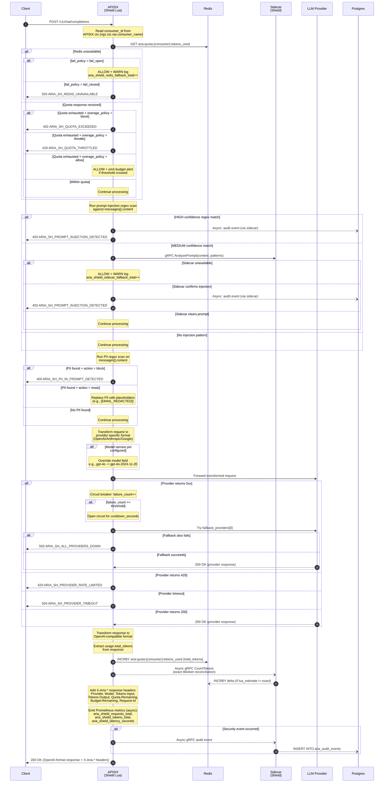
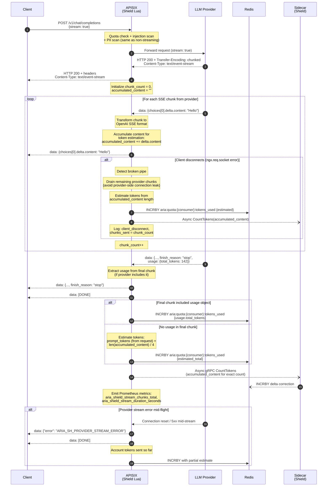
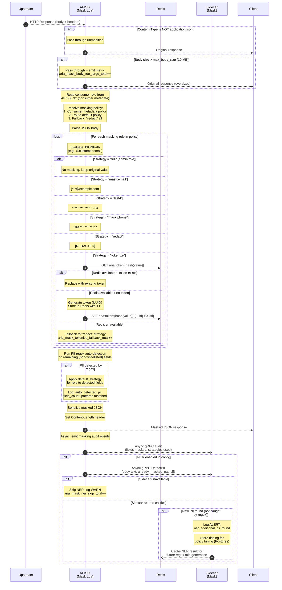
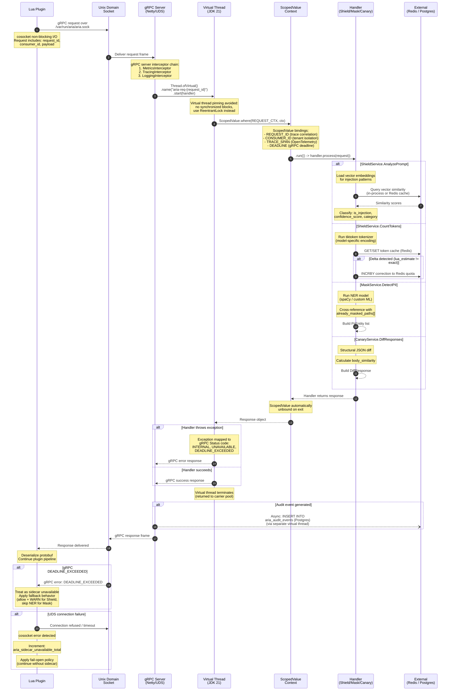

# Sequence Diagrams — 3e-Aria-Gatekeeper

**Project:** 3e-Aria-Gatekeeper
**Phase:** 4 — Design
**Version:** 1.0
**Date:** 2026-04-08
**Author:** AI Architect + Human Oversight
**Input:** HLD.md v1.0, API_CONTRACTS.md v1.0, INTEGRATION_MAP.md v1.0

---

## Table of Contents

1. [Shield: LLM Request (Full Flow)](#1-shield-llm-request-full-flow)
2. [Shield: SSE Streaming Flow](#2-shield-sse-streaming-flow)
3. [Mask: Response Masking Flow](#3-mask-response-masking-flow)
4. [Canary: Progressive Deployment Lifecycle](#4-canary-progressive-deployment-lifecycle)
5. [Sidecar: gRPC Request Lifecycle](#5-sidecar-grpc-request-lifecycle)

---

## 1. Shield: LLM Request (Full Flow)

**Covers:** Complete request lifecycle from client through Shield plugin to LLM provider and back, including quota enforcement, prompt injection detection, PII scanning, provider failover, token accounting, and audit trail.

**Key Design Decisions:**

- **Fail-open vs. fail-closed** is configurable per consumer via `quota.fail_policy`. Fail-open is the default to avoid blocking production traffic when Redis is temporarily unavailable; the warn log and metric allow operators to detect and remediate.
- **Two-tier injection detection:** Regex runs in Lua (fast, no network hop). Only MEDIUM-confidence matches go to the sidecar for vector similarity analysis, keeping p99 latency low for clean requests.
- **Approximate-then-reconcile token counting:** Lua uses the provider-reported `usage.total_tokens` for immediate quota update. The sidecar runs exact tiktoken counting asynchronously and corrects any delta, ensuring eventual accuracy without blocking the response path.
- **Circuit breaker state** is kept in Lua shared dict (per-worker) rather than Redis to avoid adding another Redis round-trip in the critical path. Providers are tried in order from `fallback_providers[]`.

---

## 2. Shield: SSE Streaming Flow

**Covers:** Server-Sent Events (SSE) streaming for `stream: true` requests, including chunk-by-chunk forwarding, incremental token counting, client disconnect handling, and final usage reconciliation.

**Key Design Decisions:**

- **Chunk-by-chunk forwarding:** Each SSE chunk is forwarded to the client as it arrives from the provider. Shield does not buffer the entire response -- this preserves streaming latency (time-to-first-token).
- **Content accumulation:** Shield accumulates `delta.content` from all chunks in memory for two purposes: (1) post-stream token estimation, and (2) passing the full content to the sidecar for exact token counting.
- **Client disconnect handling:** When the client disconnects mid-stream, Shield continues to drain remaining chunks from the provider to avoid orphaned upstream connections, then performs best-effort token accounting.
- **Token estimation fallback:** Not all providers include `usage` in the final SSE chunk. When absent, Shield uses the heuristic `len(content) / 4` for approximate token count, corrected later by the sidecar's exact tiktoken calculation.

---

## 3. Mask: Response Masking Flow

**Covers:** Response body masking on the return path, including content-type gating, role-based policy resolution, JSONPath masking, PII auto-detection, tokenization with Redis, and optional NER via sidecar.

**Key Design Decisions:**

- **Content-Type and body-size gates** run first to avoid unnecessary JSON parsing. Oversized bodies are passed through with a metric emitted so operators can tune `max_body_size` or investigate.
- **Three-level policy resolution** (consumer > route > fallback "redact") ensures that no response leaks unmasked PII even when configuration is incomplete -- the strictest strategy is the default.
- **Tokenization fallback:** When Redis is unavailable and the strategy is `tokenize`, the plugin falls back to `redact` rather than failing the request. This maintains availability at the cost of losing the reversible token mapping.
- **NER is asynchronous and optional:** The sidecar-based NER scan runs after the response has already been sent to the client (post-body_filter). Its purpose is to detect PII that regex missed, feeding back into policy tuning rather than blocking the response path.

---

## 4. Canary: Progressive Deployment Lifecycle

**Covers:** End-to-end canary deployment lifecycle from operator configuration through progressive traffic shifting, health monitoring, auto-rollback, manual overrides, and retry policies.

```mermaid
sequenceDiagram
    autonumber
    participant OP as Operator
    participant ADM as APISIX<br/>Admin API
    participant CN as APISIX<br/>(Canary Lua)
    participant R as Redis
    participant SC as Sidecar
    participant WH as Webhook

    %% --- Configuration ---
    OP->>ADM: PUT /apisix/routes/{id}<br/>plugins.aria-canary = {schedule, thresholds}
    ADM-->>OP: 200 OK

    Note over CN: Load schedule:<br/>[5%, 10%, 25%, 50%, 100%]<br/>State = STAGE_1 (5%)

    CN->>R: SET aria:canary:{route}:state STAGE_1
    CN->>R: SET aria:canary:{route}:pct 5

    %% --- Request Routing ---
    loop For each incoming request
        Note over CN: hash = crc32(client_ip) mod 100

        alt hash < traffic_pct (canary)
            CN->>CN: Route to canary_upstream
            Note over CN: Record: status, latency<br/>in sliding window (shared dict)
        else hash >= traffic_pct (baseline)
            CN->>CN: Route to baseline_upstream
            Note over CN: Record: status, latency<br/>in sliding window (shared dict)
        end

        Note over CN: Increment request counters<br/>in Redis (per-stage)
    end

    %% --- Health Check (timer-based) ---
    Note over CN: Timer fires after<br/>hold_duration expires

    CN->>R: GET canary + baseline<br/>error rates and latency

    alt Error delta > threshold_pct (2%)
        CN->>R: SET state = PAUSED
        CN--)WH: POST canary_health_breach<br/>{route, error_rates, stage}

        Note over CN: Start sustained breach timer<br/>(sustained_breach_seconds = 60)

        alt Breach sustained > 60s
            CN->>R: SET state = ROLLED_BACK
            CN->>R: SET pct = 0
            CN--)WH: POST aria_canary_rollback<br/>{trigger: "auto", retry_count}

            alt retry_policy = manual
                Note over CN: Terminal state.<br/>Operator must intervene.
            else retry_policy = auto
                Note over CN: Wait retry_cooldown (10m)
                alt retry_count < max_retries
                    CN->>R: INCR retry_count
                    CN->>R: SET state = STAGE_1, pct = 5
                    Note over CN: Restart from stage 1
                else retry_count >= max_retries
                    CN->>R: SET state = ROLLED_BACK_FINAL
                    CN--)WH: POST canary_max_retries_exhausted
                    Note over CN: Terminal state
                end
            end
        else Breach recovers within 60s
            CN->>R: SET state = RESUMED (current stage)
            CN--)WH: POST canary_resumed<br/>{route, stage}
            Note over CN: Reset hold timer,<br/>continue at current stage
        end

    else Latency p95 > baseline * multiplier (1.5x)
        CN->>R: SET state = PAUSED
        CN--)WH: POST canary_latency_breach<br/>{canary_p95, baseline_p95}
        Note over CN: Same sustained breach flow<br/>as error delta above

    else Both healthy + hold_duration elapsed
        alt Current stage is final (100%)
            CN->>R: SET state = PROMOTED, pct = 100
            CN--)WH: POST aria_canary_promoted<br/>{route, total_duration}
            Note over CN: Canary is now<br/>the production upstream
        else Not final stage
            Note over CN: ADVANCE to next stage
            CN->>R: SET state = STAGE_{n+1}<br/>pct = schedule[n+1].pct
            CN--)WH: POST canary_stage_advanced<br/>{from_stage, to_stage, pct}
            Note over CN: Reset hold timer for<br/>new stage duration
        end
    end

    %% --- Manual Overrides ---
    rect rgb(240, 240, 255)
        Note over OP,WH: Manual Override Paths

        OP->>ADM: POST /aria/canary/{route}/promote
        ADM->>CN: Update route config
        CN->>R: SET state = PROMOTED, pct = 100
        CN--)WH: POST canary_promoted<br/>{promoted_by: operator}

        OP->>ADM: POST /aria/canary/{route}/rollback
        ADM->>CN: Update route config
        CN->>R: SET state = ROLLED_BACK, pct = 0
        CN--)WH: POST canary_rollback<br/>{rolled_back_by: operator}

        OP->>ADM: POST /aria/canary/{route}/pause
        ADM->>CN: Update route config
        CN->>R: SET state = PAUSED
        Note over CN: Traffic holds at<br/>current percentage

        OP->>ADM: POST /aria/canary/{route}/resume
        ADM->>CN: Update route config
        CN->>R: SET state = current stage
        Note over CN: Resume hold timer<br/>from where paused
    end
```

**Key Design Decisions:**

- **Consistent hashing:** `crc32(client_ip) mod 100` ensures the same client consistently hits the same upstream during a canary, avoiding session-level inconsistencies. The `consistent_hash` config flag controls this behavior.
- **Sustained breach timer:** A single error spike does not trigger rollback. The error rate must remain above the threshold for `sustained_breach_seconds` (default 60s) to avoid rollback on transient blips.
- **Two-phase rollback:** PAUSE comes first, giving the system time to recover. Only if the breach is sustained does the canary proceed to ROLLED_BACK. This prevents unnecessary rollbacks during brief transient errors.
- **Retry policy:** When `retry_policy = auto`, the system waits `retry_cooldown` then restarts from stage 1, up to `max_retries` times. When `retry_policy = manual`, rollback is terminal and requires operator intervention. This prevents infinite retry loops while allowing automated recovery for transient deployment issues.
- **Metrics are kept in Lua shared dict** (per APISIX worker, aggregated on read) for the sliding window, with periodic flush to Redis for cross-worker and cross-restart consistency.

---

## 5. Sidecar: gRPC Request Lifecycle

**Covers:** Internal lifecycle of a gRPC request from Lua plugin through the Java 21 sidecar, including Unix Domain Socket transport, virtual thread creation, ScopedValue propagation, handler dispatch, and async response flow.

**Key Design Decisions:**

- **Unix Domain Socket (UDS):** Communication between Lua plugins and the Java sidecar uses `/var/run/aria/aria.sock` instead of TCP. UDS eliminates TCP overhead (no three-way handshake, no Nagle, no port exhaustion) and provides kernel-level access control via file permissions.
- **Virtual threads (JDK 21):** Each gRPC request is handled on a virtual thread rather than a platform thread. This allows the sidecar to handle thousands of concurrent requests without thread pool sizing concerns. The `synchronized` keyword is avoided in handler code to prevent virtual thread pinning.
- **ScopedValue over ThreadLocal:** `ScopedValue` (JDK 21) is used instead of `ThreadLocal` for request context propagation. ScopedValues are immutable within their scope, automatically cleaned up, and compatible with virtual threads without the memory leak risks of ThreadLocal.
- **Fail-open from Lua side:** When the sidecar is unreachable (UDS connection failure or gRPC deadline exceeded), the Lua plugin always continues with degraded functionality rather than blocking the request. The sidecar provides enhanced analysis but is never in the critical path for request completion.
- **gRPC interceptor chain** handles cross-cutting concerns (metrics, tracing, logging) before handler dispatch, keeping handler code focused on business logic.

---

## Cross-Cutting Concerns

### Error Propagation Summary

| Origin | Failure Mode | Shield Behavior | Mask Behavior | Canary Behavior |
|--------|-------------|-----------------|---------------|-----------------|
| Redis | Connection timeout | Configurable: fail_open or fail_closed | Tokenize falls back to redact | Use last-known state from shared dict |
| Sidecar (UDS) | Connection refused | Allow + WARN log | Skip NER | N/A (canary does not use sidecar in hot path) |
| Sidecar (gRPC) | DEADLINE_EXCEEDED | Allow + WARN log | Skip NER | N/A |
| LLM Provider | 5xx response | Circuit breaker, try fallback | N/A | N/A |
| LLM Provider | Timeout | 504 to client | N/A | N/A |
| Postgres | Insert failure | Audit event dropped + WARN metric | Audit event dropped + WARN metric | Audit event dropped + WARN metric |

### Async Operation Guarantees

All async operations (audit writes, token reconciliation, NER scans, webhook notifications) use fire-and-forget semantics with the following safety nets:

1. **Metrics:** Every async failure increments a dedicated Prometheus counter so operators can detect silent failures.
2. **Retry in sidecar:** The sidecar batches Postgres audit writes and retries with exponential backoff (up to 3 attempts).
3. **No request blocking:** No async operation can delay or block the client response.

---

*Document Version: 1.0 | Created: 2026-04-08*
*Status: Draft -- Pending Human Approval*
